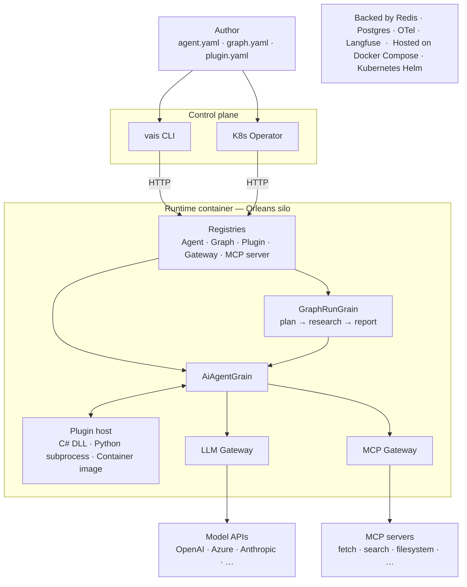
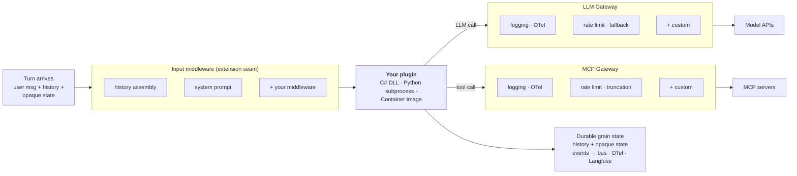

# Vais.Agents

[](https://github.com/VitalyChashin/vais-runtime/actions/workflows/ci.yml)
[](LICENSE)
[](https://dotnet.microsoft.com/download)
[](#)

> **Status: pre-alpha private preview.** API unstable.
> Trademark + NuGet-id clearance gate public release of the `Vais.Agents.*` package ids; not yet completed.

Runtime for AI agents on .NET. Declare agents and multi-agent graphs as YAML manifests, then publish them to a durable, Orleans-backed runtime with the `vais` CLI or a Kubernetes operator. Author agent code in C# (in-process DLL), Python (subprocess), or any container image speaking the plugin HTTP protocol. Microsoft Agent Framework and Semantic Kernel are first-class swappable AI stacks underneath — pick either via DI without rewriting the agent.

> 🚀 **New here?** [**QUICKSTART.md**](QUICKSTART.md) takes you from `git clone` to a running multi-agent graph with MCP tools + observable LLM/MCP gateways in ~15 minutes.

## Deployment topology



## What you get

| Capability | Packages |
|---|---|
| Declarative agents and graphs — `kind: Agent`, `kind: AgentGraph` manifests; kubectl-shape `vais apply` / `invoke` / `delete` | `Vais.Agents.Cli`, `Vais.Agents.Control.Manifests.Yaml`, `Vais.Agents.Control.Http.Server` |
| Durable runtime container — Orleans silo with grain-backed agent and graph runs; survives silo restart | `Vais.Agents.Runtime.Host` (Docker image + Helm chart + docker-compose recipes) |
| Multi-language plugins — C# DLL (in-process), Python subprocess, container image (IP-1 HTTP protocol) | `Vais.Agents.Runtime.Plugins`, `Vais.Agents.Runtime.Plugins.Python`, `Vais.Agents.Runtime.Plugins.Container` |
| LLM and MCP gateways — middleware chains for logging, OTel, rate limit, fallback, truncation, policy gating | `Vais.Agents.Core` (built-ins) + `Vais.Agents.Gateways.*` reference plugins |
| Kubernetes operator — `vais.io/v1alpha1` CRDs reconciled into running agents and graphs; OPA-gated | `Vais.Agents.Control.KubernetesOperator`, `Vais.Agents.Control.Policy.Opa` |
| Stack-neutral library — embed in any .NET app; swap MAF or SK via DI | `Vais.Agents.Abstractions`, `Vais.Agents.Core`, `Vais.Agents.Ai.SemanticKernel`, `Vais.Agents.Ai.MicrosoftAgentFramework` |
| Persistence — Redis (grain state), Postgres (durable), vector data for RAG | `Vais.Agents.Persistence.Redis`, `…Postgres`, `…VectorData` |
| Observability — OTel GenAI semantic conventions + Langfuse enrichment | `Vais.Agents.Observability.OpenTelemetry`, `Vais.Agents.Observability.Langfuse` |
| Interop — MCP tool-source adapter, A2A remote-agent-as-tool adapter | `Vais.Agents.Protocols.Mcp`, `Vais.Agents.Protocols.A2A` |

## First run — declarative

Start the runtime, declare an agent, invoke it. No C# required. Make sure `OPENAI_API_KEY` is set in your shell environment first.

```bash
# Build the runtime image, install the CLI (one-time)
docker build -f src/Vais.Agents.Runtime.Host/Dockerfile -t vais-agents-runtime:local .
dotnet tool install -g Vais.Agents.Cli --version 0.15.0-preview

# Start the runtime and point the CLI at it
# (the docker.sock mount lets the runtime supervise plugin containers later)
docker run -d --name vais -p 8080:8080 \
    -e OPENAI_API_KEY \
    -v /var/run/docker.sock:/var/run/docker.sock \
    vais-agents-runtime:local
vais config set-context local --server http://localhost:8080
```

<details><summary>PowerShell</summary>

```powershell
docker build -f src/Vais.Agents.Runtime.Host/Dockerfile -t vais-agents-runtime:local .
dotnet tool install -g Vais.Agents.Cli --version 0.15.0-preview

docker run -d --name vais -p 8080:8080 `
    -e OPENAI_API_KEY `
    -v /var/run/docker.sock:/var/run/docker.sock `
    vais-agents-runtime:local
vais config set-context local --server http://localhost:8080
```

</details>

Save the following as `planner.yaml`:

```yaml
apiVersion: vais.agents/v1
kind: Agent
metadata:
  id: planner
  version: "1.0"
spec:
  model:
    provider: openai
    name: gpt-4o-mini
  systemPrompt:
    inline: "Be concise."
  handler:
    typeName: declarative
  protocols:
    - kind: Http
```

Apply and invoke:

```bash
vais apply -f planner.yaml
vais invoke planner --text "What is the capital of France?"
```

The full multi-agent walk-through — planner → researcher → reporter graph with MCP fetch tools, observable gateways, and an optional Python plugin swap — is in [QUICKSTART.md](QUICKSTART.md).

## Inside the harness

What surrounds your plugin code on every turn:



Plugin code is the only thing you author. Everything else — input shaping, history persistence, LLM and tool call governance, observability, durability across silo restart — is the runtime. Custom middleware plugs in at the marked seams.

## Embed in a .NET app

If you'd rather embed agents in an existing .NET app instead of running the standalone runtime, every primitive is also a NuGet package. Drop `StatefulAiAgent` into an existing .NET app — same agent class works against either AI stack.

```csharp
using Microsoft.SemanticKernel;
using Vais.Agents;
using Vais.Agents.Ai.SemanticKernel;
using Vais.Agents.Core;

var kernel = Kernel.CreateBuilder()
    .AddOpenAIChatCompletion("gpt-4o-mini", Environment.GetEnvironmentVariable("OPENAI_API_KEY")!)
    .Build();

var agent = new StatefulAiAgent(
    new SkCompletionProvider(kernel),
    new StatefulAgentOptions { SystemPrompt = "Be concise." });

Console.WriteLine(await agent.AskAsync("What is the capital of France?"));
Console.WriteLine(await agent.AskAsync("And its population?"));  // History carries.
```

Swap the adapter to MAF — one `using` change, same agent class:

```csharp
using Microsoft.Extensions.AI;
using Vais.Agents.Ai.MicrosoftAgentFramework;

IChatClient client = /* your MEAI chat client */;
var agent = new StatefulAiAgent(new MafCompletionProvider(client), options);
```

## Documentation

Full docs live under **[`docs/`](docs/index.md)**. Sections by audience:

- **[Agent developer](docs/agent-developer/index.md)** — build agents.
- **[DevOps / admin](docs/devops/index.md)** — run the runtime.
- **[Deep agent development](docs/deep-development/index.md)** — author plugins.
- **[Extensions](docs/extensions/index.md)** — customize the runtime's seams.
- **[Library mode](docs/library-mode/index.md)** — embed primitives in a .NET app.

Plus [Concepts](docs/index.md#concepts) for the design model and [Reference](docs/index.md#reference) for lookup tables.

## Design principles

1. **Declarative first.** Every resource — agents, graphs, plugins, gateways, MCP servers — is publishable, updatable, and removable via `vais apply -f <manifest>.yaml` against a running runtime. No runtime restart, no filesystem drops, no `kubectl exec`.
2. **Durable by default.** Every agent and every multi-agent run is an Orleans grain. Silo restart, pod roll, and clustered scale-out are handled by the host; the agent author writes no retry logic and no checkpoint plumbing.
3. **Stack-neutral contracts, native code paths.** `Vais.Agents.Abstractions` references no SK, no MAF, no Orleans, no ASP.NET. Adapters exercise their stack's native machinery (SK's `IChatCompletionService`, MAF's `ChatClientAgent`) — never reduced to a shared `IChatClient` pass-through.
4. **Gateway is the only LLM/tool path.** Observability, rate limiting, policy, fallback, and provider routing live in middleware — not scattered across agent code. Adding a new cross-cutting concern is a gateway middleware, not a search-and-replace.
5. **Apache 2.0 across the stack** — library, runtime, operator, CLI.

## Building

Requires **.NET 9 SDK**.

Run any sample end-to-end from a fresh clone:

```bash
git clone https://github.com/VitalyChashin/vais-runtime.git
cd <repo>
dotnet pack Vais.Agents.sln --configuration Release --output artifacts/packages
OPENAI_API_KEY=sk-... dotnet run --project samples/HelloAgent
```

The `dotnet pack` step populates the local NuGet feed under `artifacts/packages/` that samples consume from via `NuGet.config`. Most samples use scripted fake completion providers and don't need `OPENAI_API_KEY`; the `HelloAgent` sample calls a real OpenAI endpoint so the key is required for that one.

Standalone build + test:

```bash
dotnet build Vais.Agents.sln
dotnet test  Vais.Agents.sln
```

Pinned deps resolve to SK 1.74, MAF 1.1, MEAI 10.5, Orleans 10.1, OpenAI 2.10. `Microsoft.Extensions.VectorData.Abstractions` is held at 10.1.0 because the SK 1.74 InMemory preview connector (used in tests) was built against that surface; lift in lockstep with SK.Connectors.InMemory.

## Contributing

See [CONTRIBUTING.md](CONTRIBUTING.md). The project is under active design — breaking changes to public API are expected until the first tagged alpha.

## License

[Apache 2.0](LICENSE).
