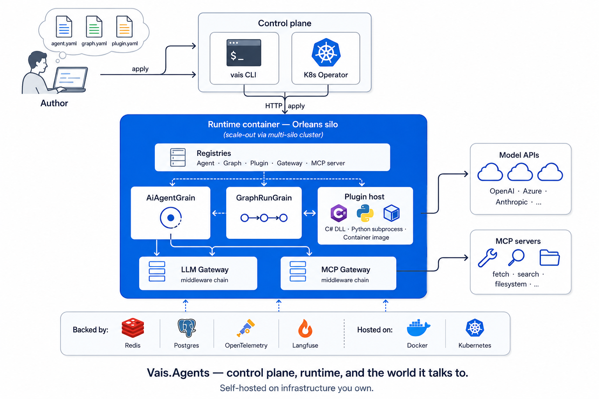
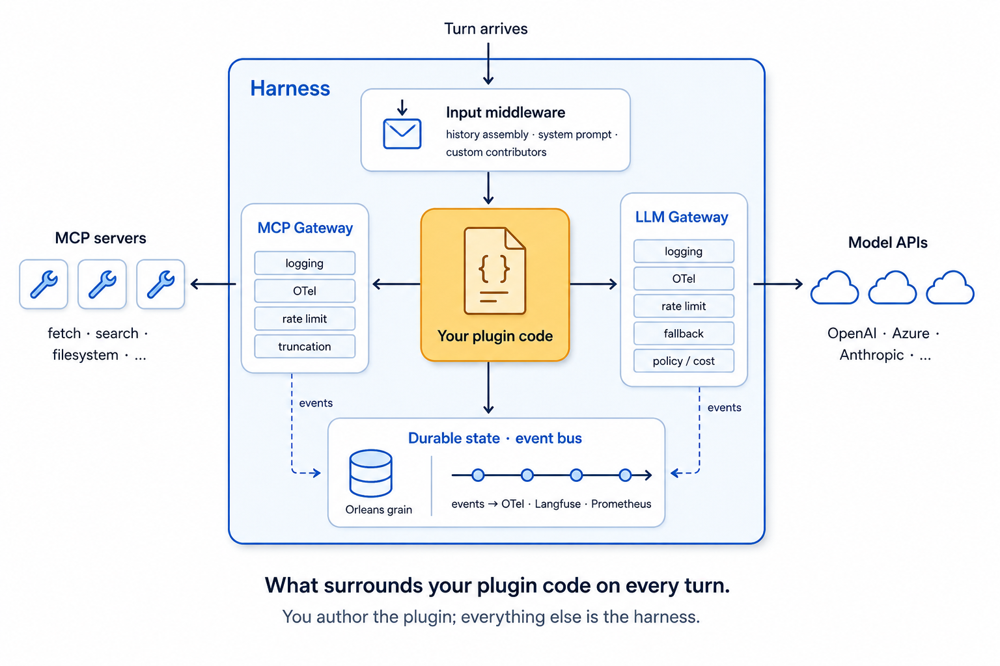

# Vais.Agents

[](https://github.com/VitalyChashin/vais-runtime/actions/workflows/ci.yml)
[](LICENSE)
[](https://dotnet.microsoft.com/download)
[](#)

> **Status: pre-alpha preview.** API unstable.

Open-source runtime for AI agents and multi-agent graphs — durable, declarative, deployed on infrastructure you own. Declare them as YAML manifests, then publish them to a durable, Orleans-backed runtime with the `vais` CLI or a Kubernetes operator. Author agent code in C# (in-process DLL), Python (subprocess), or any container image speaking the plugin HTTP protocol. Microsoft Agent Framework and Semantic Kernel are first-class swappable AI stacks underneath — pick either via DI without rewriting the agent.

> **Start here:**
> - **New to agents?** Follow the guided [Agent developer path](docs/agent-developer/index.md) — begin with [your first declarative agent](docs/agent-developer/your-first-declarative-agent.md) (~10 min, no C#), then layer on gateways, tools, Python, and graphs one tutorial at a time.
> - **Want the full tour?** [QUICKSTART.md](QUICKSTART.md) takes you from `git clone` to a running multi-agent graph with MCP tools + observable LLM/MCP gateways in ~15 minutes.
> - **Just want a taste?** The [First run](#first-run--declarative) section below is copy-paste from a clone to an invoked agent.

## Why this exists

The open-source agent landscape splits into two unsatisfying halves. **Agent frameworks** hand you the agent loop and stop — you wire your own observability, build your own durability story, and figure out how to ship it. **Durable-workflow runtimes** give you checkpoints, retries, and fan-out, but no agent — no conversation, no tool-calling loop, no LLM gateway — so you rebuild the agent on top of a workflow engine.

Vais.Agents sits between them. The runtime ships ready to deploy as a service you own, the agent *is* the unit of durability inside it, and the gateways and middleware are declarative manifests — not separately-operated services. Bring the agent code; the runtime owns the rest.

## Why Vais.Agents?

- **Durable agents, not durable workflows.** Other runtimes give you durable workflow primitives and ask you to build the agent loop on top. Vais.Agents ships the agent as the unit — one Orleans grain per `(agent, session)`, with state, history, and opaque-blob round-tripping handled by the host.
- **Declarative-first, code-aware.** YAML for the 80%: model, prompt, tools, guardrails, gateway middleware. Drop into C#, Python, or any container speaking the plugin HTTP protocol when YAML isn't enough — same `vais apply` operator surface either way.
- **Gateway is the only LLM and tool path.** Logging, OTel, rate limit, fallback, policy, cost gating — all middleware, all declared in a manifest, all applied uniformly. Adding observability is a YAML edit, not a search-and-replace across agent code.
- **Decoupled application lifecycle.** Ship agent updates without rebuilding the host application. The runtime is the operational unit; agents are content you publish into it. Same `vais apply -f` surface in Docker, Compose, and Kubernetes — the platform team operates one runtime, the agent teams iterate against it independently.
- **Native .NET, not bolted on.** Orleans for durability, MEAI for the AI contract, ASP.NET Core for HTTP, KubeOps for the operator — no node-style sidecar proxies, no foreign concurrency model. Stack-neutral underneath, too: `Vais.Agents.Abstractions` references no SK or MAF, and adapters exercise each stack's native machinery (SK's `IChatCompletionService`, MAF's `ChatClientAgent`) — swap via DI, never reduced to a shared `IChatClient` pass-through.

## Deployment topology



*Control plane, runtime, and the world it talks to. Self-hosted on infrastructure you own.*

## What you get

| Capability | Packages |
|---|---|
| Declarative agents and graphs — `kind: Agent`, `kind: AgentGraph` manifests; kubectl-shape `vais apply` / `invoke` / `delete` | `Vais.Agents.Cli`, `Vais.Agents.Control.Manifests.Yaml`, `Vais.Agents.Control.Http.Server` |
| Durable runtime container — Orleans silo with grain-backed agent and graph runs; survives silo restart | `Vais.Agents.Runtime.Host` (Docker image + Helm chart + docker-compose recipes) |
| Multi-language plugins — C# DLL (in-process), Python subprocess, container image (IP-1 HTTP protocol) | `Vais.Agents.Runtime.Plugins`, `Vais.Agents.Runtime.Plugins.Python`, `Vais.Agents.Runtime.Plugins.Container` |
| LLM and MCP gateways — middleware chains for logging, OTel, rate limit, fallback, truncation, policy gating | `Vais.Agents.Core` (built-ins) + `Vais.Agents.Gateways.*` reference plugins |
| Typed `Section[]` at the harness boundary — per-section telemetry, plugin-side `/sections/build` + server-side flatten | `Vais.Agents.Core`, `Vais.Agents.Runtime.Plugins.Container` |
| Kubernetes operator — `vais.io/v1alpha1` CRDs reconciled into running agents and graphs; OPA-gated | `Vais.Agents.Control.KubernetesOperator`, `Vais.Agents.Control.Policy.Opa` |
| Stack-neutral library — embed in any .NET app; swap MAF or SK via DI | `Vais.Agents.Abstractions`, `Vais.Agents.Core`, `Vais.Agents.Ai.SemanticKernel`, `Vais.Agents.Ai.MicrosoftAgentFramework` |
| Persistence — Redis (grain state), Postgres (durable), vector data for RAG | `Vais.Agents.Persistence.Redis`, `…Postgres`, `…VectorData` |
| Observability — OTel GenAI semantic conventions + Langfuse enrichment | `Vais.Agents.Observability.OpenTelemetry`, `Vais.Agents.Observability.Langfuse` |
| Evaluation harness — `kind: EvalSuite` manifest; batch scoring with `ToolCallSequence` / `JudgeScore` / `ResponseRegex` / `NoTurnFailed` assertions; `vais eval run / results / diff` CLI | `Vais.Agents.Eval` |
| Interop — MCP tool-source adapter, A2A remote-agent-as-tool adapter | `Vais.Agents.Protocols.Mcp`, `Vais.Agents.Protocols.A2A` |

## First run — declarative

Start the runtime, declare an agent, invoke it. No C# required. Make sure `OPENAI_API_KEY` is set in your shell environment first.

> Pre-alpha note: `Vais.Agents.Cli` is not yet on nuget.org (trademark / package-id clearance pending). For now, build the CLI package locally from a clone and install it from `artifacts/packages/`.

```bash
# Build the runtime image + the CLI package (one-time, from a clone of this repo)
docker build -f src/Vais.Agents.Runtime.Host/Dockerfile -t vais-agents-runtime:local .
dotnet pack Vais.Agents.sln --configuration Release --output artifacts/packages
dotnet tool install -g Vais.Agents.Cli --version 0.0.1-alpha --add-source ./artifacts/packages

# Start the runtime and wait until it's healthy
# (the docker.sock mount lets the runtime supervise plugin containers later)
docker run -d --name vais -p 8080:8080 \
    -e OPENAI_API_KEY \
    -v /var/run/docker.sock:/var/run/docker.sock \
    vais-agents-runtime:local
until curl -sf http://localhost:8080/healthz >/dev/null; do sleep 1; done

# Point the CLI at the runtime and activate the context
vais config set-context local --server http://localhost:8080
vais config use-context local
```

<details><summary>PowerShell</summary>

```powershell
docker build -f src/Vais.Agents.Runtime.Host/Dockerfile -t vais-agents-runtime:local .
dotnet pack Vais.Agents.sln --configuration Release --output artifacts/packages
dotnet tool install -g Vais.Agents.Cli --version 0.0.1-alpha --add-source ./artifacts/packages

docker run -d --name vais -p 8080:8080 `
    -e OPENAI_API_KEY `
    -v /var/run/docker.sock:/var/run/docker.sock `
    vais-agents-runtime:local
do { Start-Sleep -Seconds 1 } until ((Invoke-WebRequest -UseBasicParsing http://localhost:8080/healthz -ErrorAction SilentlyContinue).StatusCode -eq 200)

vais config set-context local --server http://localhost:8080
vais config use-context local
```

</details>

Save the following as `planner.yaml`:

```yaml
apiVersion: vais.agents/v1
kind: Agent
metadata:
  id: planner
  version: "1.0"
spec:
  model:
    provider: openai
    id: gpt-4o-mini
    apiKeyRef: secret://env/OPENAI_API_KEY
  systemPrompt:
    inline: "Be concise."
  handler:
    typeName: declarative
  protocols:
    - kind: Http
```

Apply and invoke:

```bash
vais apply -f planner.yaml
vais invoke planner --text "What is the capital of France?"
```

The full multi-agent walk-through — planner → researcher → reporter graph with MCP fetch tools, observable gateways, and an optional Python plugin swap — is in [QUICKSTART.md](QUICKSTART.md).

## Inside the harness



*What surrounds your plugin code on every turn. You author the plugin; everything else is the harness.*

Plugin code is the only thing you author. Everything else — input shaping, history persistence, LLM and tool call governance, observability, durability across silo restart — is the runtime. Custom middleware plugs in at the marked seams.

## Examples

Three shapes of what you can build, each self-contained.

<details><summary><b>1. Single declarative agent with an MCP tool</b></summary>

```yaml
# researcher.yaml — agent registered to use an MCP fetch server
apiVersion: vais.agents/v1
kind: Agent
metadata:
  id: researcher
  version: "1.0"
spec:
  model:
    provider: openai
    id: gpt-4o-mini
    apiKeyRef: secret://env/OPENAI_API_KEY
  systemPrompt:
    inline: |
      For each user question, fetch a relevant URL and summarise
      what you found in 2-3 sentences. Cite the URL.
  handler: { typeName: declarative }
  protocols:
    - kind: Http
  mcpServers:
    - name: mcp-fetch
      transport: registered
  tools:
    - name: fetch
      source: mcp:mcp-fetch
```

```bash
vais apply -f researcher.yaml
vais invoke researcher --text "What's on example.com?"
```

The model decides to call `fetch`, the runtime routes it through the MCP gateway middleware chain (logging, OTel, rate limit, response truncation), the agent summarises what it found. ~20 lines of YAML, zero C# code.

</details>

<details><summary><b>2. Multi-agent pipeline (graph)</b></summary>

```yaml
# research-pipeline.yaml — plan → research → report
apiVersion: vais.agents/v1
kind: AgentGraph
metadata:
  id: research-pipeline
  version: "1.0"
spec:
  entry: plan
  nodes:
    - { id: plan,     kind: Agent, ref: { id: planner,    version: "1.0" } }
    - { id: research, kind: Agent, ref: { id: researcher, version: "1.0" } }
    - { id: report,   kind: Agent, ref: { id: reporter,   version: "1.0" } }
    - { id: end,      kind: End }
  edges:
    - { from: plan,     to: research }
    - { from: research, to: report }
    - { from: report,   to: end }
```

```bash
vais invoke-graph research-pipeline \
  --initial-state '{"query": "Why is the sky blue?"}' \
  --stream
```

Event stream: `graph.started → node.started plan → node.completed plan → … → graph.completed`. Each node's output flows into the next via state bindings. Graph runs persist in Orleans grains — pod rolls and silo restarts resume where they left off.

</details>

<details><summary><b>3. <em>Optional</em>: Embed primitives in an existing .NET app (library mode) — for cases where running the full runtime is overkill: a console tool, a one-off batch job</b></summary>

```csharp
using Microsoft.SemanticKernel;
using Vais.Agents;
using Vais.Agents.Ai.SemanticKernel;
using Vais.Agents.Core;

var kernel = Kernel.CreateBuilder()
    .AddOpenAIChatCompletion("gpt-4o-mini", Environment.GetEnvironmentVariable("OPENAI_API_KEY")!)
    .Build();

var agent = new StatefulAiAgent(
    new SkCompletionProvider(kernel),
    new StatefulAgentOptions { SystemPrompt = "Be concise." });

Console.WriteLine(await agent.AskAsync("What is the capital of France?"));
Console.WriteLine(await agent.AskAsync("And its population?"));  // History carries.
```

Swap `SkCompletionProvider` for `MafCompletionProvider` to run the same agent against Microsoft Agent Framework — one `using` change, same agent class.

</details>

## Documentation

Full docs live under **[`docs/`](docs/index.md)**. Sections by audience:

- **[Agent developer](docs/agent-developer/index.md)** — build agents.
- **[DevOps / admin](docs/devops/index.md)** — run the runtime.
- **[Deep agent development](docs/deep-development/index.md)** — author plugins.
- **[Extensions](docs/extensions/index.md)** — customize the runtime's seams.
- **[Library mode](docs/library-mode/index.md)** — embed primitives in a .NET app.

Plus [Concepts](docs/index.md#concepts) for the design model and [Reference](docs/index.md#reference) for lookup tables.

## Built on / interoperates with

| Built on | Interoperates with |
|---|---|
| .NET 10 · Orleans · Microsoft.Extensions.AI · ASP.NET Core · KubeOps · Spectre.Console | Microsoft Agent Framework · Semantic Kernel · OpenAI · Anthropic · Azure OpenAI · Model Context Protocol (MCP) · Agent-to-Agent (A2A) · OpenTelemetry · Langfuse · Prometheus · OPA · Redis · Postgres |

## Building

Requires **.NET 10 SDK**.

Run any sample end-to-end from a fresh clone:

```bash
git clone https://github.com/VitalyChashin/vais-runtime.git
cd <repo>
dotnet pack Vais.Agents.sln --configuration Release --output artifacts/packages
OPENAI_API_KEY=sk-... dotnet run --project samples/HelloAgent
```

The `dotnet pack` step populates the local NuGet feed under `artifacts/packages/` that samples consume from via `NuGet.config`. Most samples use scripted fake completion providers and don't need `OPENAI_API_KEY`; the `HelloAgent` sample calls a real OpenAI endpoint so the key is required for that one.

Standalone build + test:

```bash
dotnet build Vais.Agents.sln
dotnet test  Vais.Agents.sln
```

Pinned deps resolve to SK 1.74, MAF 1.1, MEAI 10.5, Orleans 10.1, OpenAI 2.10. `Microsoft.Extensions.VectorData.Abstractions` is held at 10.1.0 because the SK 1.74 InMemory preview connector (used in tests) was built against that surface; lift in lockstep with SK.Connectors.InMemory.

## Contributing

See [CONTRIBUTING.md](CONTRIBUTING.md). The project is under active design — breaking changes to public API are expected until the first tagged alpha.

## License

[Apache 2.0](LICENSE).
