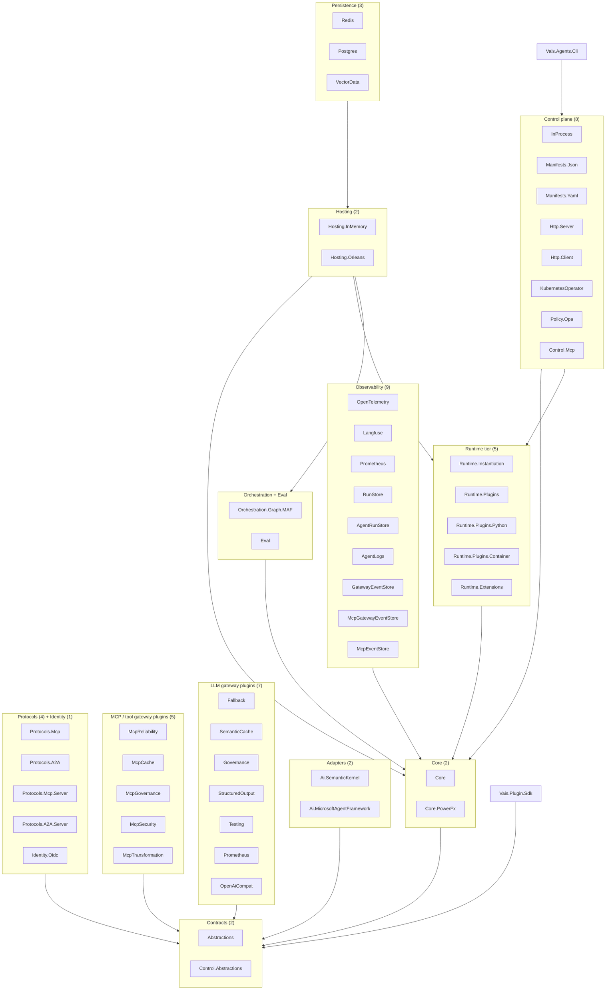

# Architecture

Vais.Agents ships as **56 projects** under `src/` — **54 NuGet packages** (52 libraries + the `Vais.Agents.Cli` dotnet tool + the `Vais.Plugin.Sdk` container-plugin SDK) plus 2 in-repo host projects that build container images rather than packages (`Vais.Agents.Runtime.Host`, `Vais.Agents.Control.KubernetesOperator.Host`, both `IsPackable=false`). Each package has one job; consumers pick the subset that matches their scenario. The dependency graph is a DAG — no cycles — but it is not a single linear stack: `Hosting.Orleans` and `Control.Http.Server` act as **aggregation layers** that reference the feature libraries the running host needs (eval, plugins, extensions, observability stores). The [packages reference](../reference/packages.md) is the authoritative per-package table.

## Package layering



The arrow `X → Y` means *packages in group X depend on group Y*. Edges are drawn group-to-group; per-package edges (and a few intra-group ones) live in the [packages reference](../reference/packages.md). A few notes on the shape:

- **Two contract layers.** `Abstractions` carries agent-shape records + provider contracts (no control-plane, no HTTP). `Control.Abstractions` adds the control-plane verb set — `IAgentLifecycleManager`, `IAgentPolicyEngine`, `IIdempotencyStore`, `AgentManifest`. Separating the two lets a consumer ship an in-process agent (needs only `Abstractions` + `Core`) without pulling in the control-plane surface.
- **Core implements the default stateful agent** (`StatefulAiAgent`) + the in-process defaults (`InMemoryAgentSession`, `InMemoryMemoryStore`, `NoopHistoryReducer`, etc.) + the zero-MAF-dep `InProcessGraphOrchestrator`. Adapters don't depend on Core; they implement `ICompletionProvider` against `Abstractions` only. `Core.PowerFx` adds the PowerFx edge-predicate evaluator on top of Core.
- **Gateway plugins** (12 total — 7 LLM + 5 MCP/tool) each depend only on `Abstractions`, with two exceptions: `Gateways.McpGovernance` reuses `Gateways.Governance`'s rate-limit store, and `Gateways.OpenAiCompat` also references `Core`. They compose into `StatefulAiAgent` via `GatewayMiddleware` / `ToolGatewayMiddleware`.
- **Observability** is 9 packages: `OpenTelemetry` + `Langfuse` enrichment, plus seven grain-backed run/event stores (`RunStore`, `AgentRunStore`, `AgentLogs`, `GatewayEventStore`, `McpGatewayEventStore`, `McpEventStore`, and the standalone `Prometheus` exporter). The stores depend on `Abstractions`/`Core` and are hosted by `Hosting.Orleans` / `Control.Http.Server`.
- **Protocols** split into outbound (`Mcp` + `A2A` — depend on `Abstractions`; surface as `ITool` / `IToolSource`) and inbound (`Mcp.Server` + `A2A.Server` — host agents as servers; depend on `Control.Abstractions`). `Identity.Oidc` rides alongside as the JWT/OIDC provider over `Control.Abstractions`.
- **Graph orchestration** comes in two flavours — the zero-dep `InProcessGraphOrchestrator` in `Core` and `Orchestration.Graph.MicrosoftAgentFramework` for the MAF-Workflows-native adapter. `Eval` sits at the same low layer (only `Abstractions` + `Core`) despite its high-level name, which is why `Hosting.Orleans`, `Control.Http.Server`, `Control.Http.Client`, and `Persistence.Postgres` can all reference it to host/expose eval-run grains.
- **Runtime tier (5).** `Runtime.Plugins` (assembly loader) → `Runtime.Instantiation` (manifest translator) → `Runtime.Plugins.Python` / `Runtime.Plugins.Container` (out-of-process plugin hosts); `Runtime.Extensions` is the seam-middleware loader. These are the libraries that turn stored manifests + plugin DLLs/images into running agents.
- **Hosting is an aggregation layer.** `Hosting.InMemory` is the dev/test runtime (`Abstractions` + `Core` only); `Hosting.Orleans` bridges the runtime into grains **and** hosts the eval, plugin, and extension grains, so it references `Eval` + `Runtime.Plugins` + `Runtime.Extensions` directly. Persistence packages (`Redis`, `Postgres`) layer on top of `Hosting.Orleans`.
- **Control plane** is 8 packages: `Control.InProcess` (reference runtime), `Control.Manifests.{Json,Yaml}` (wire-format loaders), `Control.Http.{Server,Client}` (HTTP surface), `Control.KubernetesOperator` (K8s reconcile over the HTTP client), `Control.Policy.Opa` (external-OPA adapter), and `Control.Mcp` (MCP-server registry + virtual-MCP binding). `Control.Http.Server` is the second aggregation layer — it mounts the plugin hosts and observability stores.
- **CLI + SDK.** `Vais.Agents.Cli` sits on top — a dotnet tool over `Control.Http.Client` + `Control.Manifests.Yaml`. `Vais.Plugin.Sdk` is independent: it depends only on `Abstractions` and ships to external authors building container plugins.

## Abstractions — what lives there

Pure contracts + value records. No implementation beyond defaults that belong to the contract itself (`RunBudget.Unlimited`, `ContextContribution.Empty`, `NoopHistoryReducer.Instance`, etc.).

Core contract families:

| Family | Types |
|---|---|
| Chat messages | `ChatTurn`, `AgentChatRole`, `CompletionRequest`, `CompletionResponse`, `CompletionUpdate`, `ToolCallRequest`, `ToolCallOutcome` |
| Providers | `ICompletionProvider`, `IStreamingCompletionProvider` |
| Agent | `IAiAgent`, `IStreamingAiAgent` (v0.12), `IAgentSession`, `IAgentRuntime` |
| Memory | `IMemoryStore`, `MemoryScope`, `MemoryItem`, `MemorySearchResult`, `MemoryDurability`, `IHistoryReducer` |
| Context | `IContextProvider`, `ISectionResolver`, `ISectionWindowPacker`, `ISectionTelemetrySink`, `ITokenCounter`, `ContextContribution`, `Section`, `SectionKind`, `SectionPayload` (+ `TextPayload`/`TurnPayload`/`ToolsPayload`/`ResponseFormatPayload`/`MetadataPayload`), `SectionBudget`, `SectionBudgetContext`, `SectionPackResult`, `PackerOutcome`, `PackerOutcomes`, `SectionTelemetrySnapshot`, `SectionMeasurement`, `SectionBudgetSummary`, `ContextInvocationContext`. Legacy `IContextWindowPacker` still works via `LegacyPackerAdapter`. |
| Prompt | `IPromptTemplate`, `ISystemPromptComposer` (+ `ComposeSectionsAsync`), `ISystemPromptContributor` (+ `SectionId`) |
| Guardrails | `IInputGuardrail`, `IOutputGuardrail`, `IToolGuardrail`, `GuardrailOutcome`, `GuardrailDecision`, `GuardrailLayer`, `AgentGuardrailDeniedException` |
| Execution | `IToolCallDispatcher`, `RunBudget`, `AgentBudgetExceededException`, `AgentInterrupt`, `ResumeInput`, `AgentInterruptedException`, `IStreamingAgentFilter`, `AgentInputMiddleware`, `AgentInputContext`, `IAgentInputMiddlewareFactory` |
| Tools | `ITool`, `IToolRegistry`, `IToolSource` |
| Orchestration | `IAgentOrchestrator`, `AgentParticipant`, `OrchestrationStep`, `Handoff`, `ITerminationCondition` |
| Graph orchestration (v0.9) | `IAgentGraph<TState>` / `IAgentGraph`, `IResumableAgentGraph<TState>`, `AgentGraphManifest`, `GraphNode`, `GraphEdge`, `GraphEdgePredicate`, `GraphPredicateOperator`, `GraphEdgeEffect`, `IGraphCodeNode` / `IGraphEdgePredicate` / `IGraphEdgeEffect` / `IGraphCheckpointer` |
| Events | `AgentEvent` (12 subclasses — adds `RequestSectionsBuilt` to the v0.12 set), `AgentGraphEvent` (10 subclasses, v0.9), `IAgentEventBus` |
| Control plane (contract) | `AgentManifest` (+ sub-records — `Model`, `SystemPromptSpec`, `Guardrails`, `Budget`, `OutputSchema`, `SecretRefs`, …) |
| Observability | `UsageRecord`, `IUsageSink`, `AgentContext`, `IAgentContextAccessor`, `IAgentFilter` |
| RAG | `IKnowledgeRetriever`, `KnowledgeChunk` |

No `Microsoft.SemanticKernel.*`, no `Microsoft.Agents.AI.*`, no `Orleans.*`, no `Microsoft.AspNetCore.*` references. That's the boundary.

`Control.Abstractions` adds the control-plane contracts: `IAgentLifecycleManager`, `IAgentRegistry`, `IAgentIdentityProvider`, `AgentHandle`, `AgentStatus`, `AgentPrincipal`, `IIdempotencyStore`, `IAgentPolicyEngine`, `PolicyDecision`, `PolicyOperation`, `IAgentAuditLog`, `IAgentSecretResolver`. Same no-runtime-deps discipline.

## Core — what lives there

Defaults + the execution-loop implementation. `StatefulAiAgent` is the entry point; everything else is either a default implementation of an Abstractions contract (`InMemoryAgentSession`, `NullMemoryStore.Instance`, `NoopContextWindowPacker.Instance`, `DefaultToolCallDispatcher`, `FormatStringPromptTemplate.Instance`, `AggregatingSystemPromptComposer`, `TerminationConditions.FromPredicate`, etc.) or a diagnostics constant (`AgenticDiagnostics`, `AgenticTags`, `AgenticMetrics`).

`StatefulAiAgent` is where the outer tool-call loop lives — both for `AskAsync` and `StreamAsync`. Implements both `IAiAgent` and `IStreamingAiAgent`. See the [execution loop concept](execution-loop.md).

Also in Core: the zero-MAF-dep graph orchestrator — `InProcessGraphOrchestrator<TState>` + `InMemoryCheckpointer`. Works with any `ICompletionProvider` + any `IAgentLifecycleManager`.

## Adapters — what lives there

One class per adapter: `SkCompletionProvider` (SK) and `MafCompletionProvider` (MAF). Each implements both `ICompletionProvider` and `IStreamingCompletionProvider`.

Internal translation helpers (`SkToolBinder`, `MafToolBinder`) are `internal` — they wrap our neutral `ITool` into the stack's native shape (`KernelPlugin` for SK, `AIFunction` for MAF) via MEAI's `AIFunction` bridge. Consumers don't see these.

## Hosting — InMemory vs Orleans

Two hosts, same `IAgentRuntime` contract:

- **`InMemoryAgentRuntime`** (`Vais.Agents.Hosting.InMemory`): `ConcurrentDictionary`-backed. One process, no cluster, zero persistence. Perfect for dev, tests, CLI tools. Exposes `IAgentEventBus` as `InMemoryAgentEventBus`.
- **`OrleansAgentRuntime`** (`Vais.Agents.Hosting.Orleans`): virtual-actor-backed. Each agent runs as an `AiAgentGrain`; per-session state lives in `AgentSessionGrain`; per-agent config in `AgentConfigGrain`. Events flow via `OrleansAgentEventBus` over Orleans streams. Grain storage is the persistence seam — swap in Redis or Postgres via the matching `Vais.Agents.Persistence.*` package.

Both hosts produce indistinguishable behaviour from the agent's point of view — `StatefulAiAgent` runs inside either.

Orleans-specific additions added in later pillars: `OrleansTaskStore` (v0.8 A2A durable `input-required`), `OrleansCheckpointer` (v0.9 graph checkpoints), `OrleansIdempotencyStore` (v0.11 HTTP idempotency across silo restart).

## Protocols — outbound + inbound

Four packages, two directions:

- **Outbound** (`Protocols.Mcp` + `Protocols.A2A`) — make peer services available inside your agent as `ITool` / `IToolSource`. `McpToolSource` pulls tools from an MCP server into the local registry; `A2ARemoteAgentTool` wraps a remote A2A agent as a tool.
- **Inbound** (`Protocols.Mcp.Server` + `Protocols.A2A.Server`) — host your agents as servers in the respective protocol. Consumers outside your process see them as normal MCP tools / A2A endpoints.

`A2A.Server` ships `AgentCardBuilder` auto-derivation, `[StreamingEndpoint]` idempotency bypass, and an `OrleansTaskStore` for durable `input-required` tasks.

## Orchestration

Three styles live together:

- **Linear** — `SequentialOrchestrator`, `RoundRobinOrchestrator` (v0.4 built-ins in Core, over `ICompletionProvider`).
- **Handoff** — `Handoff` record (v0.4 data contract; consumer-authored control flow).
- **Graph** — `IAgentGraph<TState>` (v0.9) with Pregel/BSP super-steps, declarative manifests, checkpointable interrupts.

Graph ships two orchestrators: `InProcessGraphOrchestrator` in Core (zero-MAF-dep) and `MafGraphOrchestrator` in `Orchestration.Graph.MicrosoftAgentFramework` (translates to an MAF `Workflow`). See [graph orchestration](graph-orchestration.md).

**Cross-runtime refs (v0.20).** A `kind: Agent` node in a graph manifest can carry `ref.runtimeUrl` — an absolute http/https URI pointing at a different runtime instance. The orchestrator routes that node's invocation to `HttpAgentRemoteInvoker` (in `Control.Http.Client`) rather than the local lifecycle manager. Bearer tokens are forwarded from the inbound HTTP context. See [cross-runtime graphs](cross-runtime-graphs.md).

## Control plane

Eight packages, one seam. `Control.Abstractions` is the contract; `Control.InProcess` is the reference runtime that wraps policy + idempotency + audit around the seven `IAgentLifecycleManager` verbs. `Control.Manifests.{Json,Yaml}` are the wire-format loaders. `Control.Http.{Server,Client}` are the HTTP surface — the server ships `MapAgentControlPlane`, `AddAgentControlPlaneIdempotency` (v0.11), `AddAgentControlPlaneOpenApi` (v0.11), and the v0.12 streaming-invoke route. `Control.KubernetesOperator` wraps `Control.Http.Client` with a KubeOps reconciler over a `vais.io/v1alpha1` CRD (v0.13). `Control.Policy.Opa` adapts an external OPA server to `IAgentPolicyEngine` (v0.14). `Control.Mcp` hosts the MCP-server registry (`IMcpServerRegistry`, `PhysicalMcpConnectionService`) and virtual-MCP binding for manifests that reference `mcp:<server>` tool sources.

See [control plane concept](control-plane.md) + [Kubernetes operator concept](kubernetes-operator.md) + [OPA policy engine concept](opa-policy-engine.md).

## Observability

`AgenticDiagnostics.ActivitySource` is the single source name (`"Vais.Agents"`). `StatefulAiAgent` starts a `chat` activity per run, populates `gen_ai.*` semantic-convention tags per the OpenTelemetry GenAI spec, plus `vais.*` extensions for agent-specific fields.

`Vais.Agents.Observability.OpenTelemetry` provides:
- `OpenTelemetryUsageSink` — emits `gen_ai.client.token.usage` + `gen_ai.client.operation.duration` histograms.
- `AddAgenticInstrumentation()` extensions for `TracerProviderBuilder` + `MeterProviderBuilder`.

`Vais.Agents.Observability.Langfuse` provides:
- `LangfuseEnrichmentFilter` — reads `IAgentContextAccessor` and adds `langfuse.*` tags to the active Activity.

Later pillars added their own activity sources + tag families — `Vais.Agents.Policy.OPA` per-evaluation spans with `vais.policy.*` tags (v0.14), `vais.control.idempotency.*` tags on HTTP idempotency-middleware spans (v0.11), `vais.stream.*` tags on SSE streaming spans (v0.12). See [telemetry keys reference](../reference/telemetry-keys.md) for the full catalogue.

## Runtime tier (v0.16)

The 54 NuGet packages above are a **library**. They also ship as a **deployable runtime** — `Vais.Agents.Runtime.Host`, an in-repo composition project (not a NuGet) that builds the `vais-agents-runtime` container image. The host is the opinionated answer to "give me the runtime, I just want to run it"; the library stays stack-neutral for consumers who want to build their own host.

```
┌─ Runtime tier (deployable) ───────────────────────────────────┐
│                                                               │
│  Vais.Agents.Runtime.Host   (container + docker-compose +     │
│                              Helm chart)                      │
│                                                               │
│   • Orleans-only silo wiring — localhost or clustered mode    │
│   • All 3 durability sidecars on, in correct registration     │
│     order (TryAddSingleton footgun locked by unit tests)      │
│   • HTTP control plane + idempotency + OpenAPI + SSE          │
│   • Optional OPA sidecar, OTel export, Langfuse enrichment    │
│   • `/healthz` (liveness) + `/readyz` (silo-active gate)      │
│                                                               │
└───────┬───────────────────────────────────────────────────────┘
        │ consumes
        ▼
   ┌────────────────────────────────────────────────────────┐
   │          Library tier (54 NuGet packages)              │
   │  Core, Hosting.Orleans, Control.*, Persistence.*,      │
   │  Observability.*, Protocols.*, Orchestration.*,        │
   │  Runtime.Plugins, CLI                                  │
   └────────────────────────────────────────────────────────┘
```

Two audiences, two answers. The runtime container is the partner-facing shape (docker-compose for evaluation, Helm for Kubernetes); the library is the consumer-facing shape (custom hosts, embedded agent-in-app, unusual runtime combinations).

The host's `CompositionRoot` is the single source of truth for "how to wire the full stack" — the install guides build on it, the composition-root unit tests lock its invariants, and the v0.17–v0.20 feature tiers layer on top of the same shape. See:

- [runtime-configuration reference](../reference/runtime-configuration.md) — every knob on the container.
- [install-the-runtime-locally guide](../guides/install-the-runtime-locally.md) — docker-compose recipes.
- [deploy-the-runtime-to-kubernetes guide](../guides/deploy-the-runtime-to-kubernetes.md) — Helm chart walkthrough.

v0.16 ships the container + compose + Helm. v0.17 (below) shipped declarative agent instantiation.

## Manifest instantiation tier (v0.17)

Sits between `Runtime.Host` and the library stack — turns a stored `AgentManifest` into a running `StatefulAiAgent` without consumer-written C#. Partners write YAML; `vais apply` persists it; `vais invoke` produces a real model response.

```
┌─ Runtime.Host composition root ─────────────────────────────────┐
│                                                                 │
│  ConfigureAgentGrains((sp, id) =>                               │
│      sp.GetRequiredService<IAgentManifestTranslator>()          │
│        .TranslateForGrain(sp, id))                              │
│                                                                 │
└──────┬──────────────────────────────────────────────────────────┘
       │ activation
       ▼
┌─ Vais.Agents.Runtime.Instantiation ─────────────────────────────┐
│                                                                 │
│  IAgentManifestTranslator        (load + translate manifest)    │
│   • ModelSpec    → IModelProviderFactory → ICompletionProvider  │
│   • SystemPromptSpec  (inline / templateRef / fileRef)          │
│   • Tools         → IStaticToolRegistry / mcp: / a2a:           │
│   • GuardrailsSpec → IGuardrailFactory per (Name, Layer)        │
│   • Budget        → RunBudget                                   │
│   • Stashes CompletionProvider in StatefulAgentOptions          │
│                                                                 │
│  3 built-in IModelProviderFactory impls (openai / anthropic /   │
│    azure-openai via MEAI IChatClient)                           │
│  6 built-in IGuardrailFactory impls (LengthCap + 4 regex +      │
│    LlmAsJudge) dispatching to 5 guardrail classes in Core       │
│                                                                 │
└──────┬──────────────────────────────────────────────────────────┘
       │ produces
       ▼
   StatefulAgentOptions { CompletionProvider, SystemPrompt, …
                          ToolRegistry, Guardrails, Budget }
       │
       ▼
   AiAgentGrain constructs StatefulAiAgent + runs AskAsync
```

Key invariants:

- **`Model != null` is the declarative-path switch.** Manifests with `Model` set take the translator path; those without route to the plugin loader (v0.18+). If no loaded plugin claims the handler `typeName`, the response is `501 urn:vais-agents:handler-not-loaded`.
- **Per-agent model providers** — the grain's completion provider comes from the translated options' `CompletionProvider` slot, not a silo-wide DI singleton. Different agents on the same silo can use different providers.
- **Update eviction** — `AgentLifecycleManager.UpdateAsync` calls `IAgentManifestInvalidator.InvalidateAsync` (the translator) so next invoke re-activates with the new manifest. In-flight runs keep their original options.
- **OrleansAgentRegistry** replaces `InMemoryAgentRegistry` in the runtime host so `vais apply` persists across pod roll.

See [declarative-agents concept](declarative-agents.md) for the full pipeline; [author-an-agent-in-yaml guide](../guides/author-an-agent-in-yaml.md) for the end-to-end walkthrough.

## Plugin tier (v0.18)

Parallel to the manifest instantiation tier — adds a plugin-loader branch that runs **before** the declarative `Model` check. Partners ship DLLs whose exported `IAiAgent` types route to manifests by `AgentHandlerRef.TypeName`. Authoring details live in [runtime-plugins concept](runtime-plugins.md) + [package-an-agent-as-a-plugin guide](../guides/package-an-agent-as-a-plugin.md).

```
┌─ Runtime.Host composition root ─────────────────────────────────┐
│                                                                 │
│  AddAgentPlugins(options.PluginsDirectory)   // before          │
│  AddAgentManifestInstantiator()              // translator      │
│                                                                 │
└──────┬──────────────────────────────────────────────────────────┘
       │ scans /var/lib/vais/plugins at first resolve
       ▼
┌─ Vais.Agents.Runtime.Plugins ───────────────────────────────────┐
│                                                                 │
│  AssemblyPluginLoader          (one PluginAssemblyLoadContext   │
│                                 per subfolder; shared-types     │
│                                 carve-out keeps the DI boundary │
│                                 identity-clean)                 │
│  VaisPluginAttribute  → IAgentHandlerFactory per HandlerTypeName│
│  IAiAgent convention → DefaultHandlerFactory<T> auto-wrap       │
│  IPluginHandlerRegistry (singleton)                             │
│                                                                 │
└──────┬──────────────────────────────────────────────────────────┘
       │ translator queries TryGet(Handler.TypeName) BEFORE checking Model
       ▼
┌─ Vais.Agents.Runtime.Instantiation (plugin branch) ─────────────┐
│                                                                 │
│  matched? → factory.CreateAsync(manifest, sp, ct) →             │
│             StatefulAgentOptions { Agent = IAiAgent }           │
│                                                                 │
│  matched + Model also set?                                      │
│    → IManifestApplyDiagnosticsSink records                      │
│      handler-and-declarative-fields-both-set                    │
│    → plugin wins; declarative fields ignored                    │
│                                                                 │
│  unmatched + Model null?                                        │
│    → urn:vais-agents:handler-not-loaded (as before)             │
│                                                                 │
└──────┬──────────────────────────────────────────────────────────┘
       │
       ▼
   AiAgentGrain.OnActivateAsync prefers options.Agent verbatim
   (persisted SystemPrompt re-applied via IAiAgent.SystemPrompt)
```

Key invariants:

- **Plugin wins over declarative.** A manifest with both a loaded-plugin `Handler.TypeName` AND a `Model` gets the plugin path + a WARN. Hosts that care about the WARN wire an `IManifestApplyDiagnosticsSink`; hosts that don't, get silent overrides.
- **One `AssemblyLoadContext` per plugin subfolder.** Plugin-private deps resolve per-plugin via `AssemblyDependencyResolver`; shared types (Abstractions, Core, DI / logging / options / config abstractions, MEAI, Polly.Core) cross into the runtime's default context so type identities line up at the DI seam.
- **Non-collectible.** No hot reload in v0.18 — plugins load at silo startup and stay until the pod cycles.
- **Same DI surface as the host.** Plugin factories receive the host's full `IServiceProvider`; `ActivatorUtilities.CreateInstance` wires constructor-injected services. Trust boundary = runtime container — not a sandbox.
- **Six new URNs.** Four loader-side (`plugin-load-failed`, `plugin-abi-mismatch`, `plugin-handler-collision`, `plugin-handler-not-found`) + two translator-side (`plugin-factory-throw`, `handler-and-declarative-fields-both-set`). Only the translator URNs surface on the HTTP wire; loader URNs are startup-log-only.

See [runtime-plugins concept](runtime-plugins.md) for the plugin-authoring contract, ABI-matching rules, and security posture.

Three sibling plugin models coexist on top of this tier:

| Model | Process boundary | Communication | Concept doc |
|---|---|---|---|
| **Assembly plugin** (v0.18) | In-process (`PluginAssemblyLoadContext` per plugin) | Direct method calls | [runtime-plugins](runtime-plugins.md) |
| **Python plugin / agent** (v0.23 / v0.24) | Subprocess (stdio) | JSON-RPC / MCP | [polyglot-plugins](polyglot-plugins.md) / [polyglot-agents](polyglot-agents.md) |
| **Container plugin** (IP-1..IP-7, CP-1..CP-9) | Container (Docker / Pod) | HTTP gateway on port 5001 + HMAC token auth + optional OTLP receiver | [container-plugins](container-plugins.md) |

The container model is the strictest P12 sandbox enforcement point — read-only rootfs, dropped caps, no-new-privileges, resource limits, and (Phase 2) egress isolation via an internal-only Docker network or Kubernetes `NetworkPolicy`. Plugin egress flows through the runtime's internal gateway (`ILlmGateway`, MCP Gateway, OTLP receiver) so policy / observability / rate-limit middleware applies uniformly regardless of plugin language.

## Graph control-plane tier (v0.19)

Parallel to the agent control-plane — adds `AgentGraph` as a first-class managed object: stored in `OrleansAgentGraphRegistry`, exposed through the HTTP control plane, invocable via `POST /v1/graphs/{id}/invoke`, streamable via SSE `POST /v1/graphs/{id}/invoke/stream`, and manageable with `vais apply` / `vais get-graphs` / `vais delete-graph`.

```
┌─ HTTP control plane (existing) ────────────────────────────────────┐
│                                                                    │
│  MapAgentControlPlane()  now also mounts:                          │
│    POST   /v1/graphs                   (apply)                     │
│    GET    /v1/graphs                   (list)                      │
│    GET    /v1/graphs/{id}              (get)                       │
│    DELETE /v1/graphs/{id}              (delete)                    │
│    POST   /v1/graphs/{id}/invoke       (unary)                     │
│    POST   /v1/graphs/{id}/invoke/stream (SSE streaming)            │
│                                                                    │
└──────┬─────────────────────────────────────────────────────────────┘
       │ delegates
       ▼
┌─ AgentGraphController + AgentGraphLifecycleManager ────────────────┐
│                                                                    │
│  • IAgentGraphRegistry → OrleansAgentGraphRegistry               │
│    (same `vais.agents` grain storage, versioned manifests)         │
│  • Unary invoke  → InProcessGraphOrchestrator<JsonState>           │
│  • Stream invoke → InProcessGraphOrchestrator.StreamAsync          │
│    → SSE event serializer (same vais.agents/v1 event schema)       │
│                                                                    │
└────────────────────────────────────────────────────────────────────┘
```

Key additions:

- **`AgentGraphManifest` is now a registry citizen.** `PUT /v1/graphs` persists it in Orleans grain storage; the manifest is durable across pod rolls.
- **Mixed-kind YAML files.** A single `vais apply -f pipeline.yaml` can contain `kind: Agent` and `kind: AgentGraph` documents, applied in dependency order (agents first).
- **`vais graph-logs`.** Tails `AgentGraphEvent` SSE events from a running or historical graph run.
- **Graph schema projection.** `AgentGraphSpecProjector` projects graph manifests into the Kubernetes CRD schema via `Control.KubernetesOperator`.

See [graph as a first-class deployable concept](graph-as-deployable.md) and [deploy a graph to the runtime guide](../guides/deploy-a-graph-to-the-runtime.md).

## Agent input middleware seam

A composable interception chain that runs **before** the agent receives an inbound message — before input guardrails, before the provider call, before the plugin shim. The seam is the mandatory inbound side of the [P12 plugin sandbox contract](runtime-plugins.md) and the prerequisite for the P10 Phase-2 cognitive primitives (HCM, S-MMU, DIEE, PAS): each primitive registers as a named middleware via DI rather than modifying plugin code.

```
┌─ inbound message ──────────────────────────────────────────────┐
│                                                                │
│  AiAgentGrain.AskAsync   /   GraphNodeExecutor.ExecuteAsync    │
│  (Hosting.Orleans)           (Orchestration.Graph.MAF)         │
│                                                                │
│         │ resolves IReadOnlyList<AgentInputMiddleware>         │
│         ▼                                                      │
│  ┌──────────────────────────────────────────────────────────┐  │
│  │  AgentInputMiddleware chain                              │  │
│  │   • each Invoke(context, next, ct)                       │  │
│  │   • mutate context.Message to reshape input              │  │
│  │   • don't call next → short-circuit (suppress / cannned) │  │
│  └──────────────────────────────────────────────────────────┘  │
│         │                                                      │
│         ▼                                                      │
│  StatefulAiAgent / plugin shim  →  input guardrails  →  LLM    │
│                                                                │
└────────────────────────────────────────────────────────────────┘
```

Surface area (`Vais.Agents.Abstractions` + `Vais.Agents.Core`):

| Type | Role |
|---|---|
| `AgentInputMiddleware` (abstract) | Override `InvokeAsync(AgentInputContext, Func<Task> next, CancellationToken)`. Default is pass-through. Must be reentrant. |
| `AgentInputContext` | Carries the inbound message, agent id, run id, and a `Properties` dictionary for downstream middleware to read. |
| `IAgentInputMiddlewareFactory` | Resolves a named middleware from a `GatewayMiddlewareSpec` — same `{name, params}` shape used by the LLM / MCP gateway middleware chains. |
| `DefaultAgentInputMiddlewareFactory` (Core) | Looks up `NamedAgentInputMiddlewareRegistration` singletons by name. |
| `AddAgentInputMiddleware<T>()` / `AddNamedAgentInputMiddleware(name, factory)` / `AddDefaultAgentInputMiddlewareFactory()` | DI registration helpers. |

Wired in three execution paths so the inbound shape is identical regardless of how the agent is invoked: `AiAgentGrain` (single-agent invoke), `GraphNodeExecutor` (graph node), and `GraphJoinNodeExecutor` (join body). `MafGraphBuilder` / `MafGraphOrchestrator` plumb the chain through to every agent-kind node. Plugin authors do not see this chain — it runs entirely on the runtime side of the plugin boundary.

See [agent input middleware extension guide](../extensions/agent-input-middleware.md) for authoring a custom middleware.

## The 54 packages at a glance

See the [packages reference](../reference/packages.md) for the per-package description table with install guidance.

## Next

- [Session + memory](session.md)
- [Execution loop](execution-loop.md) — where the outer tool-call loop lives.
- [Control plane](control-plane.md) — `IAgentLifecycleManager`, HTTP surface, policy engines.
