# Architecture

Vais.Agents ships **25 packages** — 24 libraries plus the `Vais.Agents.Cli` dotnet tool. Each has one job. Consumers pick the subset that matches their scenario; dependencies between packages are strict — lower layers never reference higher ones.

## Package layering

```mermaid
flowchart TD
    subgraph Contracts
        A[Vais.Agents.Abstractions]
        CA[Vais.Agents.Control.Abstractions]
    end

    subgraph Core
        C[Vais.Agents.Core]
    end

    subgraph Adapters
        SK[Vais.Agents.Ai.SemanticKernel]
        MAF[Vais.Agents.Ai.MicrosoftAgentFramework]
    end

    subgraph Hosting
        MEM[Vais.Agents.Hosting.InMemory]
        ORL[Vais.Agents.Hosting.Orleans]
    end

    subgraph Persistence
        RED[Vais.Agents.Persistence.Redis]
        PG[Vais.Agents.Persistence.Postgres]
        VD[Vais.Agents.Persistence.VectorData]
    end

    subgraph Observability
        OT[Vais.Agents.Observability.OpenTelemetry]
        LF[Vais.Agents.Observability.Langfuse]
    end

    subgraph Protocols
        MCP[Vais.Agents.Protocols.Mcp]
        A2A[Vais.Agents.Protocols.A2A]
        MCPS[Vais.Agents.Protocols.Mcp.Server]
        A2AS[Vais.Agents.Protocols.A2A.Server]
    end

    subgraph Orchestration
        GMAF[Vais.Agents.Orchestration.Graph.MicrosoftAgentFramework]
    end

    subgraph Control plane
        CIP[Vais.Agents.Control.InProcess]
        CMJ[Vais.Agents.Control.Manifests.Json]
        CMY[Vais.Agents.Control.Manifests.Yaml]
        CHS[Vais.Agents.Control.Http.Server]
        CHC[Vais.Agents.Control.Http.Client]
        CKO[Vais.Agents.Control.KubernetesOperator]
        COP[Vais.Agents.Control.Policy.Opa]
    end

    subgraph Tools
        CLI[Vais.Agents.Cli]
    end

    C --> A
    SK --> A
    MAF --> A
    MEM --> A
    MEM --> C
    ORL --> A
    ORL --> C
    RED --> ORL
    PG --> ORL
    VD --> A
    OT --> A
    OT --> C
    LF --> A
    LF --> C
    MCP --> A
    A2A --> A
    MCPS --> A
    MCPS --> C
    A2AS --> A
    A2AS --> C
    GMAF --> A
    GMAF --> C
    CIP --> A
    CIP --> CA
    CMJ --> A
    CMJ --> CA
    CMY --> CMJ
    CHS --> CIP
    CHS --> CMJ
    CHC --> CA
    CKO --> CA
    CKO --> CHC
    COP --> CA
    CLI --> CHC
    CLI --> CMY
```



The arrow `X → Y` means *X depends on Y*. A few notes on the shape:

- **Two contract layers.** `Abstractions` carries agent-shape records + provider contracts (no control-plane, no HTTP). `Control.Abstractions` adds the control-plane verb set — `IAgentLifecycleManager`, `IAgentPolicyEngine`, `IIdempotencyStore`, `AgentManifest`. Separating the two lets a consumer ship an in-process agent (needs only `Abstractions` + `Core`) without pulling in the control-plane surface.
- **Core implements the default stateful agent** (`StatefulAiAgent`) + the in-process defaults (`InMemoryAgentSession`, `InMemoryMemoryStore`, `NoopHistoryReducer`, etc.). Adapters don't depend on Core; they implement `ICompletionProvider` against `Abstractions` only.
- **Hosting.Orleans bridges** the agent runtime into Orleans grains. Persistence packages layer on top of Hosting.Orleans because they're Orleans-provider configuration helpers.
- **Protocols** split into outbound (`Mcp` + `A2A` — depend on `Abstractions` only; surface as `ITool` / `IToolSource`) and inbound (`Mcp.Server` + `A2A.Server` — host agents as servers; depend on `Core` for the `StatefulAiAgent` hook-in).
- **Graph orchestration** comes in two flavours — the zero-dep `InProcessGraphOrchestrator` in `Core` (so you don't need to reference the MAF package just to run a graph) and `Orchestration.Graph.MicrosoftAgentFramework` for the MAF-Workflows-native adapter.
- **Control plane** is a self-contained stack: `Control.InProcess` is the zero-dep runtime; `Control.Manifests.{Json,Yaml}` are the wire-format loaders; `Control.Http.{Server,Client}` are the HTTP surface; `Control.KubernetesOperator` wraps the HTTP client with K8s reconcile; `Control.Policy.Opa` adapts an external OPA server to the `IAgentPolicyEngine` contract.
- **CLI** sits above everything — `Vais.Agents.Cli` is a dotnet tool that uses `Control.Http.Client` for HTTP calls + `Control.Manifests.Yaml` for `apply -f` parsing.

## Abstractions — what lives there

Pure contracts + value records. No implementation beyond defaults that belong to the contract itself (`RunBudget.Unlimited`, `ContextContribution.Empty`, `NoopHistoryReducer.Instance`, etc.).

Core contract families:

| Family | Types |
|---|---|
| Chat messages | `ChatTurn`, `AgentChatRole`, `CompletionRequest`, `CompletionResponse`, `CompletionUpdate`, `ToolCallRequest`, `ToolCallOutcome` |
| Providers | `ICompletionProvider`, `IStreamingCompletionProvider` |
| Agent | `IAiAgent`, `IStreamingAiAgent` (v0.12), `IAgentSession`, `IAgentRuntime` |
| Memory | `IMemoryStore`, `MemoryScope`, `MemoryItem`, `MemorySearchResult`, `MemoryDurability`, `IHistoryReducer` |
| Context | `IContextProvider`, `IContextWindowPacker`, `ContextContribution`, `ContextInvocationContext` |
| Prompt | `IPromptTemplate`, `ISystemPromptComposer`, `ISystemPromptContributor` |
| Guardrails | `IInputGuardrail`, `IOutputGuardrail`, `IToolGuardrail`, `GuardrailOutcome`, `GuardrailDecision`, `GuardrailLayer`, `AgentGuardrailDeniedException` |
| Execution | `IToolCallDispatcher`, `RunBudget`, `AgentBudgetExceededException`, `AgentInterrupt`, `ResumeInput`, `AgentInterruptedException`, `IStreamingAgentFilter` |
| Tools | `ITool`, `IToolRegistry`, `IToolSource` |
| Orchestration | `IAgentOrchestrator`, `AgentParticipant`, `OrchestrationStep`, `Handoff`, `ITerminationCondition` |
| Graph orchestration (v0.9) | `IAgentGraph<TState>` / `IAgentGraph`, `IResumableAgentGraph<TState>`, `AgentGraphManifest`, `GraphNode`, `GraphEdge`, `GraphEdgePredicate`, `GraphPredicateOperator`, `GraphEdgeEffect`, `IGraphCodeNode` / `IGraphEdgePredicate` / `IGraphEdgeEffect` / `IGraphCheckpointer` |
| Events | `AgentEvent` (9 subclasses incl. v0.12 `CompletionDelta`), `AgentGraphEvent` (9 subclasses, v0.9), `IAgentEventBus` |
| Control plane (contract) | `AgentManifest` (+ sub-records — `Model`, `SystemPromptSpec`, `Guardrails`, `Budget`, `OutputSchema`, `SecretRefs`, …) |
| Observability | `UsageRecord`, `IUsageSink`, `AgentContext`, `IAgentContextAccessor`, `IAgentFilter` |
| RAG | `IKnowledgeRetriever`, `KnowledgeChunk` |

No `Microsoft.SemanticKernel.*`, no `Microsoft.Agents.AI.*`, no `Orleans.*`, no `Microsoft.AspNetCore.*` references. That's the boundary.

`Control.Abstractions` adds the control-plane contracts: `IAgentLifecycleManager`, `IAgentRegistry`, `IAgentIdentityProvider`, `AgentHandle`, `AgentStatus`, `AgentPrincipal`, `IIdempotencyStore`, `IAgentPolicyEngine`, `PolicyDecision`, `PolicyOperation`, `IAgentAuditLog`, `IAgentSecretResolver`. Same no-runtime-deps discipline.

## Core — what lives there

Defaults + the execution-loop implementation. `StatefulAiAgent` is the entry point; everything else is either a default implementation of an Abstractions contract (`InMemoryAgentSession`, `NullMemoryStore.Instance`, `NoopContextWindowPacker.Instance`, `DefaultToolCallDispatcher`, `FormatStringPromptTemplate.Instance`, `AggregatingSystemPromptComposer`, `TerminationConditions.FromPredicate`, etc.) or a diagnostics constant (`AgenticDiagnostics`, `AgenticTags`, `AgenticMetrics`).

`StatefulAiAgent` is where the outer tool-call loop lives — both for `AskAsync` and `StreamAsync`. Implements both `IAiAgent` and `IStreamingAiAgent`. See the [execution loop concept](execution-loop.md).

Also in Core: the zero-MAF-dep graph orchestrator — `InProcessGraphOrchestrator<TState>` + `InMemoryCheckpointer`. Works with any `ICompletionProvider` + any `IAgentLifecycleManager`.

## Adapters — what lives there

One class per adapter: `SkCompletionProvider` (SK) and `MafCompletionProvider` (MAF). Each implements both `ICompletionProvider` and `IStreamingCompletionProvider`.

Internal translation helpers (`SkToolBinder`, `MafToolBinder`) are `internal` — they wrap our neutral `ITool` into the stack's native shape (`KernelPlugin` for SK, `AIFunction` for MAF) via MEAI's `AIFunction` bridge. Consumers don't see these.

## Hosting — InMemory vs Orleans

Two hosts, same `IAgentRuntime` contract:

- **`InMemoryAgentRuntime`** (`Vais.Agents.Hosting.InMemory`): `ConcurrentDictionary`-backed. One process, no cluster, zero persistence. Perfect for dev, tests, CLI tools. Exposes `IAgentEventBus` as `InMemoryAgentEventBus`.
- **`OrleansAgentRuntime`** (`Vais.Agents.Hosting.Orleans`): virtual-actor-backed. Each agent runs as an `AiAgentGrain`; per-session state lives in `AgentSessionGrain`; per-agent config in `AgentConfigGrain`. Events flow via `OrleansAgentEventBus` over Orleans streams. Grain storage is the persistence seam — swap in Redis or Postgres via the matching `Vais.Agents.Persistence.*` package.

Both hosts produce indistinguishable behaviour from the agent's point of view — `StatefulAiAgent` runs inside either.

Orleans-specific additions added in later pillars: `OrleansTaskStore` (v0.8 A2A durable `input-required`), `OrleansCheckpointer` (v0.9 graph checkpoints), `OrleansIdempotencyStore` (v0.11 HTTP idempotency across silo restart).

## Protocols — outbound + inbound

Four packages, two directions:

- **Outbound** (`Protocols.Mcp` + `Protocols.A2A`) — make peer services available inside your agent as `ITool` / `IToolSource`. `McpToolSource` pulls tools from an MCP server into the local registry; `A2ARemoteAgentTool` wraps a remote A2A agent as a tool.
- **Inbound** (`Protocols.Mcp.Server` + `Protocols.A2A.Server`) — host your agents as servers in the respective protocol. Consumers outside your process see them as normal MCP tools / A2A endpoints.

`A2A.Server` ships `AgentCardBuilder` auto-derivation, `[StreamingEndpoint]` idempotency bypass, and an `OrleansTaskStore` for durable `input-required` tasks.

## Orchestration

Three styles live together:

- **Linear** — `SequentialOrchestrator`, `RoundRobinOrchestrator` (v0.4 built-ins in Core, over `ICompletionProvider`).
- **Handoff** — `Handoff` record (v0.4 data contract; consumer-authored control flow).
- **Graph** — `IAgentGraph<TState>` (v0.9) with Pregel/BSP super-steps, declarative manifests, checkpointable interrupts.

Graph ships two orchestrators: `InProcessGraphOrchestrator` in Core (zero-MAF-dep) and `MafGraphOrchestrator` in `Orchestration.Graph.MicrosoftAgentFramework` (translates to an MAF `Workflow`). See [graph orchestration](graph-orchestration.md).

## Control plane

Seven packages, one seam. `Control.Abstractions` is the contract; `Control.InProcess` is the reference runtime that wraps policy + idempotency + audit around the seven `IAgentLifecycleManager` verbs. `Control.Manifests.{Json,Yaml}` are the wire-format loaders. `Control.Http.{Server,Client}` are the HTTP surface — the server ships `MapAgentControlPlane`, `AddAgentControlPlaneIdempotency` (v0.11), `AddAgentControlPlaneOpenApi` (v0.11), and the v0.12 streaming-invoke route. `Control.KubernetesOperator` wraps `Control.Http.Client` with a KubeOps reconciler over a `vais.io/v1alpha1` CRD (v0.13). `Control.Policy.Opa` adapts an external OPA server to `IAgentPolicyEngine` (v0.14).

See [control plane concept](control-plane.md) + [Kubernetes operator concept](kubernetes-operator.md) + [OPA policy engine concept](opa-policy-engine.md).

## Observability

`AgenticDiagnostics.ActivitySource` is the single source name (`"Vais.Agents"`). `StatefulAiAgent` starts a `chat` activity per run, populates `gen_ai.*` semantic-convention tags (per [ADR 0002](../adr/0002-otel-genai-conventions.md)), plus `vais.*` extensions for agent-specific fields.

`Vais.Agents.Observability.OpenTelemetry` provides:
- `OpenTelemetryUsageSink` — emits `gen_ai.client.token.usage` + `gen_ai.client.operation.duration` histograms.
- `AddAgenticInstrumentation()` extensions for `TracerProviderBuilder` + `MeterProviderBuilder`.

`Vais.Agents.Observability.Langfuse` provides:
- `LangfuseEnrichmentFilter` — reads `IAgentContextAccessor` and adds `langfuse.*` tags to the active Activity.

Later pillars added their own activity sources + tag families — `Vais.Agents.Policy.OPA` per-evaluation spans with `vais.policy.*` tags (v0.14), `vais.control.idempotency.*` tags on HTTP idempotency-middleware spans (v0.11), `vais.stream.*` tags on SSE streaming spans (v0.12). See [telemetry keys reference](../reference/telemetry-keys.md) for the full catalogue.

## Runtime tier (v0.16 Pillar A)

The 25 packages above are a **library**. They also ship as a **deployable runtime** — `Vais.Agents.Runtime.Host`, an in-repo composition project (not a NuGet) that builds the `vais-agents-runtime` container image. The host is the opinionated answer to "give me the runtime, I just want to run it"; the library stays stack-neutral for consumers who want to build their own host.

```
┌─ Runtime tier (deployable) ───────────────────────────────────┐
│                                                               │
│  Vais.Agents.Runtime.Host   (container + docker-compose +     │
│                              Helm chart)                      │
│                                                               │
│   • Orleans-only silo wiring — localhost or clustered mode    │
│   • All 3 durability sidecars on, in correct registration     │
│     order (TryAddSingleton footgun locked by unit tests)      │
│   • HTTP control plane + idempotency + OpenAPI + SSE          │
│   • Optional OPA sidecar, OTel export, Langfuse enrichment    │
│   • `/healthz` (liveness) + `/readyz` (silo-active gate)      │
│                                                               │
└───────┬───────────────────────────────────────────────────────┘
        │ consumes
        ▼
   ┌────────────────────────────────────────────────────────┐
   │          Library tier (25 NuGet packages)              │
   │  Core, Hosting.Orleans, Control.*, Persistence.*,      │
   │  Observability.*, Protocols.*, Orchestration.*, CLI    │
   └────────────────────────────────────────────────────────┘
```

Two audiences, two answers. The runtime container is the partner-facing shape (docker-compose for evaluation, Helm for Kubernetes); the library is the consumer-facing shape (custom hosts, embedded agent-in-app, unusual runtime combinations).

The host's `CompositionRoot` is the single source of truth for "how to wire the full stack" — the install guides build on it, the composition-root unit tests lock its invariants, and any future Pillar B / C / D / E feature layers on top of the same shape. See:

- [runtime-configuration reference](../reference/runtime-configuration.md) — every knob on the container.
- [install-the-runtime-locally guide](../guides/install-the-runtime-locally.md) — docker-compose recipes.
- [deploy-the-runtime-to-kubernetes guide](../guides/deploy-the-runtime-to-kubernetes.md) — Helm chart walkthrough.

v0.16 (Pillar A) ships the container + compose + Helm. v0.17 (Pillar B, below) resolves the 501-on-invoke story.

## Manifest instantiation tier (v0.17 Pillar B)

Sits between `Runtime.Host` and the library stack — turns a stored `AgentManifest` into a running `StatefulAiAgent` without consumer-written C#. Partners write YAML; `vais apply` persists it; `vais invoke` produces a real model response.

```
┌─ Runtime.Host composition root ─────────────────────────────────┐
│                                                                 │
│  ConfigureAgentGrains((sp, id) =>                               │
│      sp.GetRequiredService<IAgentManifestTranslator>()          │
│        .TranslateForGrain(sp, id))                              │
│                                                                 │
└──────┬──────────────────────────────────────────────────────────┘
       │ activation
       ▼
┌─ Vais.Agents.Runtime.Instantiation ─────────────────────────────┐
│                                                                 │
│  IAgentManifestTranslator        (load + translate manifest)    │
│   • ModelSpec    → IModelProviderFactory → ICompletionProvider  │
│   • SystemPromptSpec  (inline / templateRef / fileRef)          │
│   • Tools         → IStaticToolRegistry / mcp: / a2a:           │
│   • GuardrailsSpec → IGuardrailFactory per (Name, Layer)        │
│   • Budget        → RunBudget                                   │
│   • Stashes CompletionProvider in StatefulAgentOptions          │
│                                                                 │
│  3 built-in IModelProviderFactory impls (openai / anthropic /   │
│    azure-openai via MEAI IChatClient)                           │
│  6 built-in IGuardrailFactory impls (LengthCap + 4 regex +      │
│    LlmAsJudge) dispatching to 5 guardrail classes in Core       │
│                                                                 │
└──────┬──────────────────────────────────────────────────────────┘
       │ produces
       ▼
   StatefulAgentOptions { CompletionProvider, SystemPrompt, …
                          ToolRegistry, Guardrails, Budget }
       │
       ▼
   AiAgentGrain constructs StatefulAiAgent + runs AskAsync
```

Key invariants:

- **`Model != null` is the declarative-path switch.** Manifests with `Model` set take the translator path; those without trigger `501 urn:vais-agents:handler-not-loaded` until Pillar C (plugin loader) ships.
- **Per-agent model providers** — the grain's completion provider comes from the translated options' `CompletionProvider` slot, not a silo-wide DI singleton. Different agents on the same silo can use different providers.
- **Update eviction** — `AgentLifecycleManager.UpdateAsync` calls `IAgentManifestInvalidator.InvalidateAsync` (the translator) so next invoke re-activates with the new manifest. In-flight runs keep their original options.
- **OrleansAgentRegistry** replaces `InMemoryAgentRegistry` in the runtime host so `vais apply` persists across pod roll.

See [declarative-agents concept](declarative-agents.md) for the full pipeline; [author-an-agent-in-yaml guide](../guides/author-an-agent-in-yaml.md) for the end-to-end walkthrough.

## The 26 packages at a glance

See the [packages reference](../reference/packages.md) for the per-package description table with install guidance.

## Next

- [Session + memory](session.md)
- [Execution loop](execution-loop.md) — where the outer tool-call loop lives.
- [Control plane](control-plane.md) — `IAgentLifecycleManager`, HTTP surface, policy engines.
- [ADR index](../adr/index.md)
