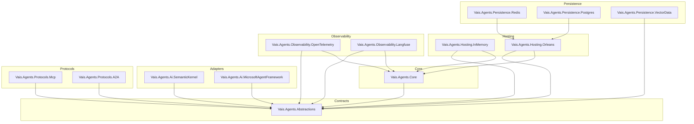

# Architecture

Vais.Agents ships 13 packages. Each has one job. Consumers pick the subset that matches their scenario; dependencies between packages are strict — lower layers never reference higher ones.

## Package layering

The arrow `X → Y` means *X depends on Y*. A few notes on the shape:

- **Abstractions is a leaf.** It references no SK, no MAF, no Orleans — only stable BCL types. Everyone depends on it; it depends on nothing that matters.
- **Core implements the default stateful agent** (`StatefulAiAgent`) + the in-process defaults (`InMemoryAgentSession`, `InMemoryMemoryStore`, `NoopHistoryReducer`, etc.). Adapters don't depend on Core; the adapter authors implement `ICompletionProvider` against Abstractions only.
- **Hosting.Orleans bridges** the agent runtime into Orleans grains. Persistence packages layer on top of Hosting.Orleans because they're Orleans-provider configuration helpers.
- **Protocols** (MCP + A2A) depend on Abstractions only — they surface outside tools and remote agents as `ITool` / `IToolSource`.

## Abstractions — what lives there

Pure contracts + value records. No implementation beyond defaults that belong to the contract itself (`RunBudget.Unlimited`, `ContextContribution.Empty`, `NoopHistoryReducer.Instance`, etc.).

Core contract families:

| Family | Types |
|---|---|
| Chat messages | `ChatTurn`, `AgentChatRole`, `CompletionRequest`, `CompletionResponse`, `CompletionUpdate`, `ToolCallRequest`, `ToolCallOutcome` |
| Providers | `ICompletionProvider`, `IStreamingCompletionProvider` |
| Agent | `IAiAgent`, `IAgentSession`, `IAgentRuntime` |
| Memory | `IMemoryStore`, `MemoryScope`, `MemoryItem`, `MemorySearchResult`, `MemoryDurability`, `IHistoryReducer` |
| Context | `IContextProvider`, `IContextWindowPacker`, `ContextContribution`, `ContextInvocationContext` |
| Prompt | `IPromptTemplate`, `ISystemPromptComposer`, `ISystemPromptContributor` |
| Guardrails | `IInputGuardrail`, `IOutputGuardrail`, `IToolGuardrail`, `GuardrailOutcome`, `GuardrailDecision`, `GuardrailLayer`, `AgentGuardrailDeniedException` |
| Execution | `IToolCallDispatcher`, `RunBudget`, `AgentBudgetExceededException`, `AgentInterrupt`, `ResumeInput`, `AgentInterruptedException`, `IStreamingAgentFilter` |
| Tools | `ITool`, `IToolRegistry`, `IToolSource` |
| Orchestration | `IAgentOrchestrator`, `AgentParticipant`, `OrchestrationStep`, `Handoff`, `ITerminationCondition` |
| Events | `AgentEvent`, `IAgentEventBus` + 8 sealed event subclasses |
| Control plane | `AgentManifest` (+ 7 sub-records), `IAgentLifecycleManager`, `IAgentRegistry`, `IAgentIdentityProvider`, `AgentHandle`, `AgentStatus`, `AgentPrincipal` |
| Observability | `UsageRecord`, `IUsageSink`, `AgentContext`, `IAgentContextAccessor`, `IAgentFilter` |
| RAG | `IKnowledgeRetriever`, `KnowledgeChunk` |

No `Microsoft.SemanticKernel.*`, no `Microsoft.Agents.AI.*`, no `Orleans.*` references. That's the boundary.

## Core — what lives there

Defaults + the execution-loop implementation. `StatefulAiAgent` is the entry point; everything else is either a default implementation of an Abstractions contract (`InMemoryAgentSession`, `NullMemoryStore.Instance`, `NoopContextWindowPacker.Instance`, `DefaultToolCallDispatcher`, `FormatStringPromptTemplate.Instance`, `AggregatingSystemPromptComposer`, `TerminationConditions.FromPredicate`, etc.) or a diagnostics constant (`AgenticDiagnostics`, `AgenticTags`, `AgenticMetrics`).

`StatefulAiAgent` is where the outer tool-call loop lives — both for `AskAsync` and `StreamAsync`. See the [execution loop concept](execution-loop.md).

## Adapters — what lives there

One class per adapter: `SkCompletionProvider` (SK) and `MafCompletionProvider` (MAF). Each implements both `ICompletionProvider` and `IStreamingCompletionProvider`.

Internal translation helpers (`SkToolBinder`, `MafToolBinder`) are `internal` — they wrap our neutral `ITool` into the stack's native shape (`KernelPlugin` for SK, `AIFunction` for MAF) via MEAI's `AIFunction` bridge. Consumers don't see these.

## Hosting — InMemory vs Orleans

Two hosts, same `IAgentRuntime` contract:

- **`InMemoryAgentRuntime`** (`Vais.Agents.Hosting.InMemory`): `ConcurrentDictionary`-backed. One process, no cluster, zero persistence. Perfect for dev, tests, CLI tools. Exposes `IAgentEventBus` as `InMemoryAgentEventBus`.
- **`OrleansAgentRuntime`** (`Vais.Agents.Hosting.Orleans`): virtual-actor-backed. Each agent runs as an `AiAgentGrain`; per-session state lives in `AgentSessionGrain`; per-agent config in `AgentConfigGrain`. Events flow via `OrleansAgentEventBus` over Orleans streams. Grain storage is the persistence seam — swap in Redis or Postgres via the matching `Vais.Agents.Persistence.*` package.

Both hosts produce indistinguishable behaviour from the agent's point of view — `StatefulAiAgent` runs inside either.

## Observability

`AgenticDiagnostics.ActivitySource` is the single source name (`"Vais.Agents"`). `StatefulAiAgent` starts a `chat` activity per run, populates `gen_ai.*` semantic-convention tags (per [ADR 0002](../adr/0002-otel-genai-conventions.md)), plus `vais.*` extensions for agent-specific fields.

`Vais.Agents.Observability.OpenTelemetry` provides:
- `OpenTelemetryUsageSink` — emits `gen_ai.client.token.usage` + `gen_ai.client.operation.duration` histograms.
- `AddAgenticInstrumentation()` extensions for `TracerProviderBuilder` + `MeterProviderBuilder`.

`Vais.Agents.Observability.Langfuse` provides:
- `LangfuseEnrichmentFilter` — reads `IAgentContextAccessor` and adds `langfuse.*` tags to the active Activity.

## The 13 packages at a glance

See the [packages reference](../reference/packages.md) for a per-package description table.

## Next

- [Session + memory](session.md)
- [Execution loop](execution-loop.md) — where the outer tool-call loop lives.
- [ADR index](../adr/index.md)
