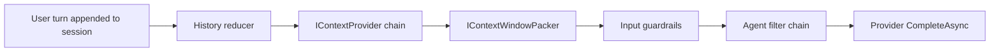

# Context

"Context" here means the information a turn needs that **isn't** in the session history — retrieved documents, ambient policy rules, conditionally-attached tools. Vais.Agents exposes context via a **provider chain** + a **window packer**, both wired between the history reducer and the filter chain inside the agent's turn loop.

## Where context fits in the turn



Every `AskAsync` and `StreamAsync` turn hits the context stage. Providers run in configured order; the packer runs once at the end of the chain to apply any token-budget-aware pruning.

## Core types

```csharp
namespace Vais.Agents;

public interface IContextProvider
{
    Task<ContextContribution> InvokeAsync(ContextInvocationContext context, CancellationToken cancellationToken = default);
}

public interface IContextWindowPacker
{
    Task<CompletionRequest> PackAsync(CompletionRequest request, CancellationToken cancellationToken = default);
}

public sealed record ContextContribution(
    string? SystemPromptAddendum = null,
    IReadOnlyList<ChatTurn>? InjectedHistory = null,
    IReadOnlyList<ITool>? AdditionalTools = null)
{
    public static readonly ContextContribution Empty = new();
}

public sealed record ContextInvocationContext(
    CompletionRequest Candidate,
    AgentContext AmbientContext,
    IAgentSession Session);
```

Providers **never mutate**; they return a `ContextContribution` that the agent merges into the candidate request.

## Merge rules

When multiple providers contribute:

- **`SystemPromptAddendum`** — concatenated in provider order, joined by `\n\n`. Prior addenda preserved; new text appended.
- **`InjectedHistory`** — appended **after** the session history. Canonical layering: here's some retrieved context (injected turns), now here's the actual conversation (session turns with latest user turn at tail).
- **`AdditionalTools`** — concatenated with existing `CompletionRequest.Tools`.

If a provider returns `ContextContribution.Empty` (or a contribution with all-null fields), it's a no-op.

## Window packer

Runs **after** the provider chain. Default is `NoopContextWindowPacker.Instance` (identity). Non-default implementations trim `InjectedHistory` / reduce `SystemPrompt` size to fit a token budget. v0.4 ships no non-identity packer — bring your own.

## Wiring

```csharp
var agent = new StatefulAiAgent(
    provider,
    new StatefulAgentOptions
    {
        ContextProviders = new IContextProvider[]
        {
            new TimeAndTenantProvider(),
            new KnowledgeRetrievalContextProvider(retriever),  // from Vais.Agents.Persistence.VectorData
        },
        // ContextWindowPacker = new MyTokenBudgetPacker(),
    });
```

Providers run top-to-bottom; later providers see contributions from earlier ones via the merged `request`.

## A custom provider

```csharp
sealed class TimeAndTenantProvider : IContextProvider
{
    public Task<ContextContribution> InvokeAsync(ContextInvocationContext ctx, CancellationToken ct)
    {
        var now = DateTimeOffset.UtcNow.ToString("yyyy-MM-dd HH:mm:ss 'UTC'");
        var tenant = ctx.AmbientContext.TenantId ?? "(no-tenant)";
        return Task.FromResult(new ContextContribution(
            SystemPromptAddendum: $"Current time: {now}. Tenant: {tenant}."));
    }
}
```

The `ContextInvocationContext.Candidate` is the request *as built so far* — useful if your provider needs to peek at the history or the tool list. `AmbientContext` is the `IAgentContextAccessor.Current` snapshot for the run. `Session` lets you introspect `History` if your retrieval logic keys off it.

## RAG-specific provider

`Vais.Agents.Persistence.VectorData` ships `KnowledgeRetrievalContextProvider` — takes a last-user-turn-keyed retrieval over any `Microsoft.Extensions.VectorData` store, returns the top-K chunks as a `SystemPromptAddendum` via a template. See the [persistence concept](persistence.md#rag) and the [RAG guide](../guides/wire-rag-via-vectordata.md).

## Extension points

- **`IContextProvider`** — implement one method; synchronous or async.
- **`IContextWindowPacker`** — for post-merge pruning.
- **Order matters.** The agent runs providers in the order you listed. Earlier providers' contributions are visible to later providers via the `Candidate`.

## Failure semantics

Providers are **load-bearing** — an exception fails the turn (`TurnFailed` event + rethrow). This is a design decision, not an oversight: retrieval that silently swallows failures masks data-quality bugs. Consumers who want swallow semantics wrap their provider with a resilience-handling decorator. Similar choice to how `IAgentFilter` propagates exceptions.

## Observability

- No per-provider events in v0.4 — providers run inline in the turn-building phase, before any event emission. Consumers who want per-provider timing can wrap providers manually; a future `ContextProviderInvoked` event is on the deferred list.
- `vais.agent.name` + ambient context tags still apply to the per-turn Activity.

## Limitations / known gaps

- **No provider-level caching contract.** Consumers cache inside their provider or wrap it. No cache-key convention baked in.
- **`InjectedHistory` is appended after session history** — no way to prepend. If you need "here's a summary then the conversation then more context", return it split across two providers OR inject via `SystemPromptAddendum` instead of `InjectedHistory`.
- **Legacy `KnowledgeRetrievalFilter`** (`Vais.Agents.Persistence.VectorData`) is `[Obsolete(DiagnosticId="VAIS0001")]` since v0.4 — it used the older `IAgentFilter` pipeline. New code uses `KnowledgeRetrievalContextProvider`. The obsolete filter stays for one release; removal is planned for v0.5.

## See also

- [Architecture](architecture.md)
- [Prompt](prompt.md) — `SystemPromptAddendum` combines with the prompt composer's output.
- [Execution loop](execution-loop.md) — exact position of the context stage.
- [Wire RAG via VectorData guide](../guides/wire-rag-via-vectordata.md)
