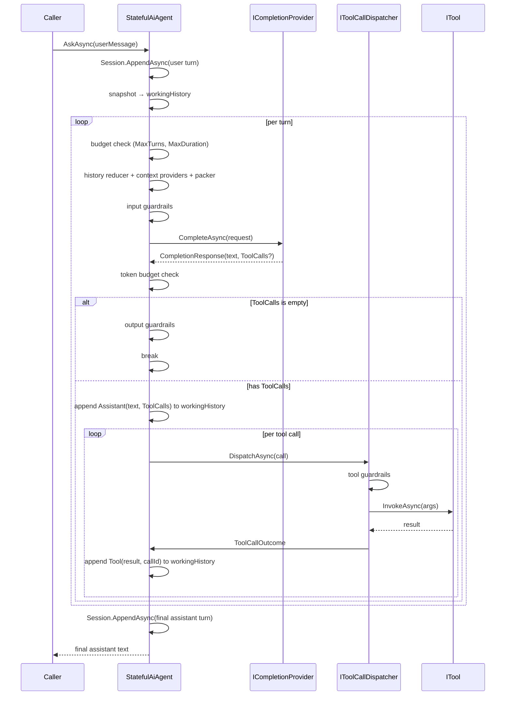

# Execution loop

`StatefulAiAgent` owns the outer tool-call loop — the same loop for `AskAsync` and `StreamAsync`. SK and MAF adapters are "one-shot completion providers" (they return a response with text + optional tool calls); the agent drives the iteration.

## The loop



`StreamAsync` follows the same shape: each iteration streams `CompletionUpdate`s; a terminal update carrying `ToolCalls` kicks the tool-dispatch branch, then the next iteration opens a new stream. Consumer-visible `IAsyncEnumerable<string>` surface — text deltas across all turns, tool dispatches invisible to the consumer stream (but visible on the event bus).

## Core types

```csharp
namespace Vais.Agents;

public sealed record ToolCallRequest(string ToolName, JsonElement Arguments, string CallId);
public sealed record ToolCallOutcome(string CallId, string Result, string? Error = null);

public interface IToolCallDispatcher
{
    Task<ToolCallOutcome> DispatchAsync(ToolCallRequest request, AgentContext context, CancellationToken cancellationToken = default);
}

public sealed record RunBudget(
    int? MaxTurns = null,
    int? MaxToolCalls = null,
    int? MaxPromptTokens = null,
    int? MaxCompletionTokens = null,
    TimeSpan? MaxDuration = null)
{
    public static readonly RunBudget Unlimited = new();
}

public sealed class AgentBudgetExceededException : Exception
{
    public string BudgetField { get; }
    public object Limit { get; }
    public object Actual { get; }
}

public sealed record AgentInterrupt(string InterruptId, string Reason, JsonElement Payload);
public sealed record ResumeInput(string InterruptId, JsonElement Payload);
public sealed class AgentInterruptedException : Exception { public AgentInterrupt Interrupt { get; } }
```

## Working history vs session history

The loop maintains a **working history** list for the run — it starts as `Session.History.ToArray()` (which already includes the just-appended user turn) and grows with `ChatTurn.Assistant(text, ToolCalls: ...)` + `ChatTurn.Tool(result, ToolCallId: callId)` turns between iterations. The session itself is only mutated twice per run:

1. User turn appended at run entry.
2. Final assistant turn appended at run exit (only on success).

So `Session.History` is always clean alternating user / assistant turns, while intra-run tool-dispatch rounds live only in the ephemeral working history fed into each turn's `CompletionRequest`. This matches Bedrock AgentCore / OpenAI Assistants semantics and keeps `IAgentSession` persistence payloads small.

## RunBudget — where each field trips

| Field | Checked at | Behaviour |
|---|---|---|
| `MaxTurns` | top of each turn | throws `AgentBudgetExceededException("MaxTurns", ...)` |
| `MaxDuration` | top of each turn | throws `AgentBudgetExceededException("MaxDuration", ...)` |
| `MaxPromptTokens` | after provider returns | sum across all turns; throws on breach |
| `MaxCompletionTokens` | after provider returns | sum across all turns; throws on breach |
| `MaxToolCalls` | before each dispatch | counts every dispatch in the run; throws on breach |

All budgets count **across** tool-call iterations in the same run — not per-iteration. `RunBudget.Unlimited` is the default.

## Interrupts (HITL)

`AgentInterrupt` is raised when any guardrail layer returns `GuardrailOutcome.Interrupt(payload)`. The agent publishes `InterruptRaised` then throws `AgentInterruptedException(interrupt)`. The caller:

1. Catches `AgentInterruptedException`.
2. Inspects `ex.Interrupt.InterruptId`, `.Reason`, `.Payload`.
3. Gathers a human decision (or machine-automated approval in non-interactive flows).
4. Builds a `ResumeInput(interrupt.InterruptId, responsePayload)`.
5. Calls `agent.ResumeAsync(resumeInput)`.

v0.4's `ResumeAsync` is a **shim** — it forwards `resumeInput.Payload` as the next user turn through `AskAsync`. True mid-loop resume (picking up exactly where the interrupt paused, with working-history replay) ships with the durable-execution pillar. In v0.4 the interrupt-id correlation still flows through for observability; the behaviour is a new turn, not a continuation of the interrupted one. Documented explicitly.

## Wiring

```csharp
var agent = new StatefulAiAgent(
    provider,
    new StatefulAgentOptions
    {
        ToolRegistry = registry,
        Budget = new RunBudget(MaxTurns: 5, MaxToolCalls: 10, MaxDuration: TimeSpan.FromSeconds(30)),
        ToolGuardrails = toolGuardrails,   // passed to DefaultToolCallDispatcher
        // ToolCallDispatcher = new MyCustomDispatcher(...),  // override the default
    });

try
{
    var reply = await agent.AskAsync("What's the weather in Paris? Then email a summary.");
}
catch (AgentInterruptedException ex)
{
    var decision = await PromptHumanAsync(ex.Interrupt);
    var resume = new ResumeInput(ex.Interrupt.InterruptId, JsonSerializer.SerializeToElement(decision));
    await agent.ResumeAsync(resume);
}
catch (AgentBudgetExceededException ex)
{
    Console.Error.WriteLine($"Budget {ex.BudgetField} exceeded: limit={ex.Limit}, observed={ex.Observed}");
}
```

## Tool-using streaming

`StatefulAiAgent.StreamAsync` uses the same outer-loop shape. `CompletionUpdate` gained `IReadOnlyList<ToolCallRequest>? ToolCalls` in v0.4.1 — providers emit a terminal `CompletionUpdate` with `ToolCalls` populated when the model wants to call tools, and the loop re-enters the stream after dispatch. Consumer surface stays `IAsyncEnumerable<string>` — tool observability flows through the event bus.

SK streaming uses SK's built-in `FunctionCallContentBuilder` to accumulate streamed `StreamingFunctionCallUpdateContent` fragments. MAF streaming walks `AgentRunResponseUpdate.Contents` for `FunctionCallContent` items, deduplicates by `CallId`.

See the [stream-with-tools guide](../guides/stream-with-tools.md) for the full recipe.

## Events

One `TurnStarted` at run entry + one `TurnCompleted` or `TurnFailed` at run exit — enveloping the whole multi-turn run. Per-tool events (`ToolCallStarted`, `ToolCallCompleted`) + `GuardrailTriggered` + `InterruptRaised` fire inside the loop. See [events reference](../reference/events.md).

## Extension points

- **`IToolCallDispatcher`** — inject a custom dispatcher for bespoke invocation semantics. Default `DefaultToolCallDispatcher` runs tool guardrails, invokes via `ITool.InvokeAsync`, catches exceptions into `ToolCallOutcome.Error`, emits events. Any replacement should preserve that envelope.
- **`IStreamingAgentFilter`** — per-delta transform + post-drain hook for `StreamAsync`.
- **`IAgentFilter`** — the ordered `CompletionRequest → CompletionResponse` chain (AskAsync only; streaming doesn't apply it in v0.4.1).

## Limitations / known gaps

- **Filters + resilience pipeline are bypassed on `StreamAsync`** — v0.4.1 scope. `IAgentFilter` is synchronous request→response; wrapping a stream either buffers (defeating the point) or needs a new surface. Streaming-filter surface is deferred.
- **`ResumeAsync` is a shim in v0.4** — true durable resume needs the durable-execution pillar.
- **Budget overruns raise exceptions mid-iteration.** No "graceful stop with partial result" yet.

## See also

- [Architecture](architecture.md)
- [Tools](tools.md) — `ITool` + `Tool.FromFunc` + `IToolSource`.
- [Guardrails](guardrails.md) — the three layers the dispatcher + agent invoke.
- [Events reference](../reference/events.md) — 8-subclass `AgentEvent` closed hierarchy.
- [Budget reference](../reference/budget.md) — `RunBudget` fields.
