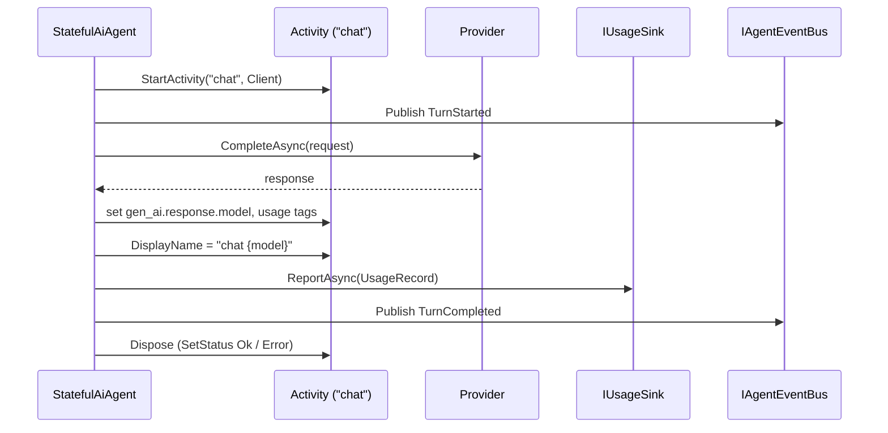

# Observability

Three overlapping but distinct signals flow out of a Vais.Agents run:

1. **OpenTelemetry activities + metrics** — one activity per `AskAsync` / `StreamAsync` run, histogram metrics for token usage and operation duration. Uses the OTel **GenAI semantic conventions** (`gen_ai.*`) plus `vais.*` extensions for agent-specific data.
2. **`AgentEvent` bus** — structured business events (`TurnStarted`, `TurnCompleted`, `ToolCallStarted`, …). Useful for UI streams, audit logs, monitoring dashboards. Not a telemetry stream — consumers subscribe explicitly.
3. **`UsageRecord` sink** — per-turn numeric summary (tokens + duration + context). Feeds billing dashboards or cost controls.

All three ship null implementations by default; none cost anything unless you wire a listener / sink / bus.

## OpenTelemetry

### Source + meter

```csharp
namespace Vais.Agents.Core;

public static class AgenticDiagnostics
{
    public const string ActivitySourceName = "Vais.Agents";
    public const string MeterName = "Vais.Agents";
    public static readonly ActivitySource ActivitySource = new(ActivitySourceName);
}
```

Every `StatefulAiAgent` run calls `ActivitySource.StartActivity("chat", ActivityKind.Client)`. Returns `null` when no listener is registered — zero allocation. The activity gets renamed to `"chat {model}"` once the model id is known.

### Wiring

```csharp
using OpenTelemetry;
using OpenTelemetry.Trace;
using OpenTelemetry.Metrics;
using Vais.Agents.Observability.OpenTelemetry;

using var tracer = Sdk.CreateTracerProviderBuilder()
    .AddAgenticInstrumentation()         // adds source "Vais.Agents"
    .AddOtlpExporter()
    .Build();

using var meter = Sdk.CreateMeterProviderBuilder()
    .AddAgenticInstrumentation()         // adds meter "Vais.Agents"
    .AddOtlpExporter()
    .Build();

services.AddAgenticOpenTelemetrySink();  // registers OpenTelemetryUsageSink → IUsageSink
```

### Tag catalogue

GenAI conventions (adopted verbatim):

| Tag | Source |
|---|---|
| `gen_ai.system` | `ICompletionProvider.ProviderName` |
| `gen_ai.operation.name` | always `"chat"` |
| `gen_ai.response.model` | `CompletionResponse.ModelId` |
| `gen_ai.usage.input_tokens` | `CompletionResponse.PromptTokens` |
| `gen_ai.usage.output_tokens` | `CompletionResponse.CompletionTokens` |

`vais.*` extensions (agent-specific):

| Tag | Source |
|---|---|
| `vais.agent.name` | `AgentContext.AgentName` or `StatefulAgentOptions.AgentName` |
| `vais.user.id` | `AgentContext.UserId` |
| `vais.tenant.id` | `AgentContext.TenantId` |
| `vais.correlation.id` | `AgentContext.CorrelationId` |

See [telemetry keys reference](../reference/telemetry-keys.md) for the full table.

### Metrics

`OpenTelemetryUsageSink` emits:

- `gen_ai.client.token.usage` (histogram, unit `{token}`) — split by `gen_ai.token.type = "input" | "output"`.
- `gen_ai.client.operation.duration` (histogram, unit `s`) — decorated with `error.type` on failure.

Common dimensions: `gen_ai.system`, `gen_ai.response.model`, `gen_ai.operation.name`.

## `AgentEvent` bus

Structured business events fired around the agent's lifecycle. Closed hierarchy — 12 sealed subclasses:

- `TurnStarted(At, Context, UserMessage)`
- `TurnCompleted(At, Context, AssistantText, ModelId?, PromptTokens?, CompletionTokens?, Duration)`
- `TurnFailed(At, Context, ErrorType, ErrorMessage, Duration)`
- `ToolCallStarted(At, Context, CallId, ToolName)`
- `ToolCallCompleted(At, Context, CallId, ToolName, Succeeded, Error?, Duration)`
- `ToolCallReplayed(At, Context, CallId, ToolName)` — journal-replay short-circuit (durable-execution path)
- `GuardrailTriggered(At, Context, Layer, Decision, Reason?)`
- `InterruptRaised(At, Context, InterruptId, Reason)`
- `HandoffRequested(At, Context, Handoff)`
- `CompletionDelta(At, Context, TextDelta, ModelId?, PromptTokens?, CompletionTokens?, ToolCalls?)` — streaming text delta (v0.12)
- `RequestSectionsBuilt(At, Context, TurnIndex, Sections, Budget)` — per-section telemetry snapshot
- `EvalRunProgress(At, Context, EvalRunId, ProgressKind, CaseId?, CaseStatus?)` — eval-run progress (SSE)

See [events reference](../reference/events.md).

### Wiring

```csharp
using Vais.Agents.Hosting.InMemory;

var bus = new InMemoryAgentEventBus();
var agent = new StatefulAiAgent(provider, new StatefulAgentOptions { EventBus = bus });

using var subscription = bus.Subscribe(async (@event, ct) =>
{
    Console.WriteLine($"{@event.At:O} {@event.GetType().Name}");
});

await agent.AskAsync("hello");
```

Orleans-hosted agents use `OrleansAgentEventBus` over a stream provider named `vais.agents.events`. Configure a stream provider (`AddMemoryStreams`, `AddEventHubStreams`, or `UseAgenticRedisStreaming`) on both silo and client sides. See [persistence](persistence.md#orleans-streams).

Bus failures are swallowed + logged — a misbehaving subscriber can't break the agent's main flow.

## `UsageRecord` sink

Numeric summary per turn. Intended for billing / cost dashboards.

```csharp
public sealed record UsageRecord(
    string ProviderName,
    string ModelId,
    int? PromptTokens,
    int? CompletionTokens,
    TimeSpan Duration,
    DateTimeOffset StartedAt,
    bool Succeeded,
    string? AgentName = null,
    string? UserId = null,
    string? TenantId = null,
    string? CorrelationId = null,
    string? ErrorType = null);

public interface IUsageSink
{
    ValueTask ReportAsync(UsageRecord record, CancellationToken cancellationToken = default);
}
```

Default `NullUsageSink.Instance` does nothing. `OpenTelemetryUsageSink` from `Vais.Agents.Observability.OpenTelemetry` forwards to the OTel meter. Consumers write their own (database-backed, Kafka-fed, HTTP-batched) by implementing one method.

**Cancellation is not a failure** — `StatefulAiAgent` does not emit a `UsageRecord` on `OperationCanceledException`, by design. If the caller asked to stop, don't inflate error metrics.

## Langfuse enrichment

`Vais.Agents.Observability.Langfuse` ships `LangfuseEnrichmentFilter : IAgentFilter` — a stack-neutral filter that reads `IAgentContextAccessor.Current` and tags the active Activity with `langfuse.*` keys that Langfuse's OTel collector maps into its UI.

```csharp
using Vais.Agents.Observability.Langfuse;

services.AddLangfuseEnrichment(new LangfuseEnrichmentOptions
{
    DefaultTags = new[] { "vais-agents", "production" },
    AnonymousUserFallback = "anonymous",
});
```

Tags emitted on every enriched span:

- `langfuse.user.id` ← `vais.user.id`
- `langfuse.session.id` ← `vais.correlation.id` (mapping is hard-coded; not currently exposed as a Langfuse-enrichment option)
- `langfuse.trace.name` ← agent name
- `langfuse.tags` ← `DefaultTags` + per-run additions

No Langfuse-specific exporter is required — any OTLP-compatible backend receives the `langfuse.*` tags; Langfuse's collector recognises them.

## Activity lifecycle



On failure: `Activity.SetStatus(ActivityStatusCode.Error)`, `error.type` tag, `TurnFailed` event, usage record with `Succeeded = false`.

## Extension points

- **Multiple `IUsageSink`s** — wrap them manually or ship your own composite.
- **`IAgentContextAccessor`** — `AsyncLocalAgentContextAccessor` (in `Vais.Agents.Core`) uses an `AsyncLocal` and is the standard impl for in-process hosts; Orleans hosts use `OrleansAgentContextAccessor`. Inject your own if you have ambient request context via a different mechanism.
- **`IAgentFilter`** — the ordered `CompletionRequest → CompletionResponse` chain is the natural place for per-turn unary enrichment (add headers, inject tenant policy, redact). For streaming, register an `IStreamingAgentFilter` (added in v0.10) — the streaming pipeline runs its own filter chain on the `IAsyncEnumerable<CompletionUpdate>` rather than re-using `IAgentFilter`.

## Observability of the observability

`ActivitySource` is process-global. Test projects that listen on `"Vais.Agents"` must disable xUnit parallelisation (`[assembly: CollectionBehavior(DisableTestParallelization = true)]`) — otherwise a parallel test's activity leaks into the listener under test. This is a testing rule, not a runtime concern.

## Limitations / known gaps

- **No `AgentRunStarted` / `AgentRunCompleted` envelope events** spanning multi-turn tool-call loops. `TurnStarted` + `TurnCompleted` fire once per `AskAsync` call, enveloping the whole run (including intermediate tool dispatches). If you need per-LLM-call events, emit them from a custom `IAgentFilter`.
- **Langfuse enricher reads via `IAgentContextAccessor`**, so if you don't set ambient context (e.g. inject `AgentContextAccessor.Push` in a web handler), the enricher tags land empty.
- **The GenAI spec is experimental.** Tag names may shift; we rebump when they do.

## See also

- [Architecture](architecture.md)
- [Events reference](../reference/events.md)
- [Telemetry keys reference](../reference/telemetry-keys.md)
- [Deploy OTel and Langfuse guide](../guides/deploy-otel-and-langfuse.md)
